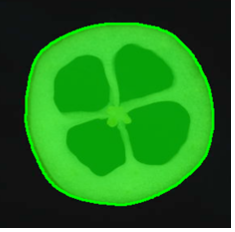
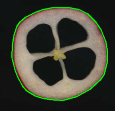
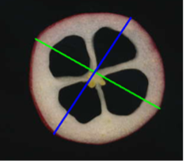
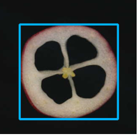
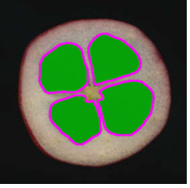
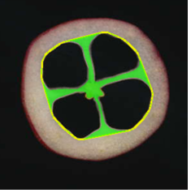
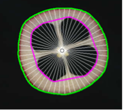
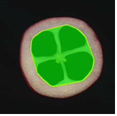
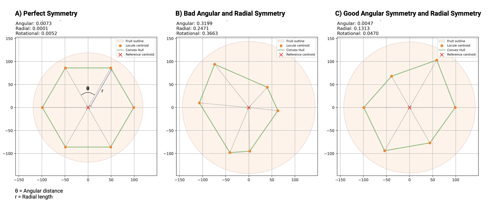

# Documentación de Traitly

## Introducción

Traitly es una herramienta integral de fenotipado que analiza la estructura interna de frutos y extrae características morfológicas, estructurales y de color a partir de imágenes567890-. Este documento describe todos los rasgos (características) que Traitly puede medir y exportar.

 

### ¿Qué mide Traitly?

Traitly analiza frutos detectando sus contornos y estructuras internas (lóculos/semillas) para calcular:

- **Morfología básica**: Tamaño, forma y propiedades geométricas
- **Estructura interna**: Número, tamaño y distribución de lóculos
- **Características del pericarpio**: Grosor y uniformidad de las paredes del fruto
- **Simetría**: Patrones de distribución angular y radial
- **Propiedades de color**: Análisis de color multicanal (opcional)

Para más detalles, consulte la sección: [**Tablas de Rasgos**](#tablas-de-rasgos)

 

### Requisitos de las Imágenes de Entrada

Traitly está diseñado para analizar **imágenes transversales (cortes) de frutos** adquiridas usando un **escáner**.

Para garantizar una segmentación precisa y una extracción confiable de rasgos, se recomiendan las siguientes condiciones:

* Los frutos deben cortarse en **rodajas transversales** y colocarse planas sobre el escáner.
* El fondo debe ser **uniforme y negro** (usar una caja de cartón negro sobre el escáner ayuda a bloquear la luz ambiente).
* Recomendamos usar una **resolución consistente entre imágenes**, aunque Traitly puede procesar imágenes de cualquier tamaño.
* Evite sombras, reflejos, rodajas superpuestas o bajo contraste entre el fruto y el fondo.

### Elementos opcionales

Traitly puede detectar opcionalmente:

* **Marcadores de referencia de tamaño** (puntos negros) para calibración de píxeles a métrica
* **Etiquetas de texto**
* **Códigos QR** para identificación de muestras

Estos elementos no son obligatorios pero se recomiendan para experimentos a gran escala y flujos de trabajo automatizados.

### Generación de etiquetas y códigos QR

El diseño de las etiquetas es flexible. Por conveniencia, proporcionamos una herramienta en línea simple para generar etiquetas QR desde un archivo de texto:

* Generador de etiquetas QR en línea: [https://qrlabel.streamlit.app/](https://qrlabel.streamlit.app/)
* Alternativa sin conexión disponible en nuestro [repositorio qrlabel](https://github.com/mariameraz/qrlabel)

 

### Formatos de salida

Traitly genera las siguientes salidas para cada imagen procesada:

**Archivos CSV:**
- **`*_results.csv`**: Rasgos morfológicos y estructurales (área, perímetro, simetría, etc.)
- **`*_color_results.csv`**: Rasgos de color (canales RGB, HSV, Lab) — solo cuando `extract_color=True`

**Informes de sesión:**
- **`session_report.txt`**: _Solo disponible para análisis por lotes_. Resumen del procesamiento con fecha, hora, total de imágenes procesadas, frutos detectados, tiempo de procesamiento, uso de RAM y todos los parámetros utilizados
- **`error_report.csv`**: Información del estado para cada imagen procesada (proceso exitoso, errores o archivos omitidos)

**Imágenes anotadas:**
- **`*_annotated.jpg`**: Salida visual con contornos detectados e IDs únicos para cada fruto
  - Contornos verdes: Límites de el fruto
  - Contornos magenta: Límites de los lóculos
  - Contornos amarillos: Cavidad interna (lóculos + pulpa interna)
  - Puntos amarillos: Centroides de los loculos
  - Punto azul: Centroide del fruto
  - Etiquetas: ID de el fruto y conteo de lóculos (ej., "id 1: 4 loc")

Cada fruto recibe un ID secuencial único (`fruit_id`) que vincula la anotación visual con su fila correspondiente en el archivo CSV, permitiendo una fácil referencia cruzada entre imágenes y mediciones.

 

---

## Tabla de Rasgos

Acerca de la tabla:

- Cada rasgo incluye una **descripción**, **fórmula** y **rango esperado**
- Los rasgos que terminan en `_cm` / `_cm2` requieren calibración física (círculos de referencia)
- Los rasgos que terminan en `_px` están en unidades de píxeles (no necesitan calibración)
- Las métricas sin unidades (proporciones, porcentajes) funcionan independientemente de la calibración

### 1. IDENTIFICACIÓN

| Rasgo | Descripción | Fórmula | Tipo/Rango |
|-------------|------------------------------------------------|---------|-----------|
| `image_name` | Nombre del archivo de imagen procesado | N/A | `str` |
| `label` | Etiqueta o tratamiento detectado (QR/OCR) | N/A | `str` |
| `fruit_id` | ID secuencial único de el fruto en la imagen | N/A | `int` ≥ 1 |
| `n_locules` | Número total de lóculos detectados en el fruto | N/A | `int` ≥ 0 |
| `unit` | Unidad de medida utilizada (`'cm'` o `'px'`) | N/A | `str` |

---

### 2. MORFOLOGÍA DE EL FRUTO

| Rasgo | Descripción | Fórmula | Tipo/Rango |
|-------------------------------------------|--------------------------------------------------------------|---------------------------------------------------|-------------|
| `fruit_area_cm2` / `fruit_area_px` | Área total de el fruto:  

  | `cv2.contourArea(contour)`  | `float` > 0 | 
| `fruit_perimeter_cm` / `fruit_perimeter_px` | Perímetro del contorno de el fruto: 

 | `cv2.arcLength(contour, True)` | `float` > 0 |
| `fruit_circularity` | Medida de qué tan circular es el fruto (1 = círculo perfecto) | `(4π × area) / perimeter²` | `float` 0–1 |
| `fruit_solidity` | Proporción del área de el fruto relativa a su envolvente convexa | `area / convex_area` | `float` 0–1 |
| `fruit_compactness` | Medida de compacidad del contorno | `perimeter² / area` | `float` ≥ 4π |
| `fruit_convex_hull_area_cm2` / `fruit_convex_hull_area_px` | Área de la envolvente convexa de el fruto | `cv2.contourArea(convexHull)` | `float` > 0 |
| `major_axis_cm` / `major_axis_px` | Longitud del eje mayor (distancia máxima entre puntos):  

 | `max(euclidean_distances)` | `float` > 0 |
| `minor_axis_cm` / `minor_axis_px` | Longitud del eje menor (ancho perpendicular al eje mayor):  

| `max(perpendicular_projections) - min(projections)` | `float` > 0 |
| `box_length_cm` / `box_length_px` | Longitud de la caja delimitadora rotada mínima (lado más largo):  

 | `max(width, height)` de `minAreaRect` | `float` > 0 |
| `box_width_cm` / `box_width_px` | Ancho de la caja delimitadora rotada mínima (lado más corto):  

 | `min(width, height)` de `minAreaRect` | `float` > 0 |
| `aspect_ratio` | Relación entre el ancho y la longitud de la caja | `box_width / box_length` | `float` 0–1 |
| `compactness_index` | Índice de compacidad de el fruto relativo a la caja delimitadora | `fruit_area / (box_length × box_width)` | `float` 0–1 |

---

### 3. ESTADÍSTICAS DE LÓCULOS

| Rasgo | Descripción | Fórmula | Tipo/Rango |
|-----------------------------------|-------------------------------------------------------|----------------------------------|---------------|
| `locule_cavity_area_cm2` / `locule_cavity_area_px` | Área total combinada de lóculos:  

 | `sum(locule_areas)` | `float` ≥ 0 |
| `mean_area_cm2` / `mean_area_px` | Área media de lóculos | `mean(locule_areas)` | `float` > 0 |
| `std_area_cm2` / `std_area_px` | Desviación estándar del área de lóculos | `std(locule_areas)` | `float` ≥ 0 |
| `cv_area` | Coeficiente de variación del área de lóculos (homogeneidad) | `(std / mean) × 100` | `float` ≥ 0 (%) |
| `mean_circularity` | Circularidad media de los lóculos | `mean((4π × area) / perimeter²)` | `float` 0–1 |
| `std_circularity` | Desviación estándar de la circularidad de lóculos | `std(circularities)` | `float` ≥ 0 |
| `cv_circularity` | Coeficiente de variación de la circularidad | `(std / mean) × 100` | `float` ≥ 0 (%) |
| `internal_flesh_area_cm2` / `internal_flesh_area_px` | Área de pulpa interna (cavidad interna menos lóculos):  

 |  `internal_cavity_area - total_locule_area` | `float` ≥ 0 |

---

### 4. MÉTRICAS DEL PERICARPIO

| Rasgo | Descripción | Fórmula | Tipo/Rango |
|------------------------------------------------------|--------------------------------------------------------|------------------------------------------------------|---------------|
| `outer_pericarp_ratio` | Proporción del pericarpio externo relativo al total de el fruto | `(fruit_area - inner_area) / fruit_area` | `float` 0–1 |
| `mean_thickness_cm` / `mean_thickness_px` | Grosor medio del pericarpio:  

 | `mean(radial_distances)` desde el contorno externo al interno (por defecto = 180 rayos) | `float` > 0 | 
| `median_thickness_cm` / `median_thickness_px` | Grosor mediano del pericarpio | `median(radial_distances)` | `float` > 0 |
| `std_thickness_cm` / `std_thickness_px` | Desviación estándar del grosor del pericarpio | `std(radial_distances)` | `float` ≥ 0 |
| `min_thickness_cm` / `min_thickness_px` | Grosor mínimo del pericarpio | `min(radial_distances)` | `float` > 0 |
| `max_thickness_cm` / `max_thickness_px` | Grosor máximo del pericarpio | `max(radial_distances)` | `float` > 0 |
| `cv_thickness` | Coeficiente de variación del grosor (uniformidad) | `(std / mean) × 100` | `float` ≥ 0 (%) |
| `lobedness_cm` / `lobedness_px` | Irregularidad de la superficie de el fruto (desviación estándar de los radios externos) | `std(outer_radial_distances)` | `float` ≥ 0 |
| `internal_cavity_area_cm2` / `internal_cavity_area_px` | Área total de la cavidad interna:  

 | `inner_pericarp_area` | `float` ≥ 0 |

---

### 5. MÉTRICAS DE SIMETRÍA

| Rasgo | Descripción | Fórmula | Tipo/Rango |
|----------------------|----------------------------------------------------------------|-------------------------------------------------------------------|-------------|
| `angular_symmetry` | Simetría angular de la distribución de lóculos (menor = más simétrico): 

 | Error angular medio después de la alineación óptima con distribución ideal | `float` ≥ 0 |
| `radial_symmetry` | Simetría radial de las distancias de lóculos desde el centro (0 = perfecto): 

 | `std(radii) / mean(radii)` (CV de distancias radiales) | `float` ≥ 0 |
| `rotational_symmetry` | Simetría rotacional combinada (angular + radial, 0 = perfecto) | Combinación ponderada y normalizada de errores angulares y radiales | `float` 0–1 |

---

### 6. MÉTRICAS DERIVADAS

| Rasgo | Descripción | Fórmula | Tipo/Rango |
|------------------------------------------------|-------------------------------------------------------|-------------------------------------------------|-----------------|
| `internal_cavity_ratio` | Proporción de la cavidad interna relativa al total de el fruto | `inner_area / fruit_area` | `float` 0–1 |
| `locule_to_fruit_ratio` | Proporción de lóculos relativos al total de el fruto | `total_locule_area / fruit_area` | `float` 0–1 |
| `locule_to_cavity_ratio` | Proporción de lóculos relativos a la cavidad interna | `total_locule_area / inner_area` | `float` 0–1 |
| `flesh_to_cavity_ratio` | Proporción de pulpa relativa a la cavidad interna | `(inner_area - total_locule_area) / inner_area` | `float` 0–1 |
| `locule_to_fruit_percentage` | Porcentaje del área total ocupada por lóculos | `(total_locule_area / fruit_area) × 100` | `float` 0–100 (%) |
| `locule_to_cavity_percentage` | Eficiencia de empaquetamiento de lóculos dentro de la región interna | `(total_locule_area / inner_area) × 100` | `float` 0–100 (%) |

---

### 7. MÉTRICAS DE COLOR (Opcional - cuando `extract_color=True`)

**NOTA:** Las métricas de color se extraen para tres regiones: **whole_fruit** (fruto completa), **outer_pericarp** (pericarpio externo) e **inner_pericarp** (pericarpio interno). Cada región tiene su propio conjunto de características de color con el nombre de la región como prefijo (ej., `wholefruit_R_mean`, `outerpericarp_L_mean`, `innerpericarp_H_mean`).

| Patrón de Rasgo | Descripción | Fórmula/Método | Tipo/Rango |
|--------------------------------|----------------------------------------------------------|-----------------------------------|----------------|
| `{region}_R_{stat}` | Estadística del canal rojo | `mean` o `median` de valores R | `float` 0–255 |
| `{region}_G_{stat}` | Estadística del canal verde | `mean` o `median` de valores G | `float` 0–255 |
| `{region}_B_{stat}` | Estadística del canal azul | `mean` o `median` de valores B | `float` 0–255 |
| `{region}_H_{stat}` | Estadística de matiz (0–360°) | `mean` o `median` de valores H | `float` 0–360 |
| `{region}_S_{stat}` | Estadística de saturación (0–100%) | `mean` o `median` de valores S | `float` 0–100 |
| `{region}_V_{stat}` | Estadística de valor/brillo (0–100%) | `mean` o `median` de valores V | `float` 0–100 |
| `{region}_L_{stat}` | Estadística de luminosidad (0–100) | `mean` o `median` de valores L* | `float` 0–100 |
| `{region}_a_{stat}` | Estadística del eje verde-rojo (-128 a +127) | `mean` o `median` de valores a* | `float` -128–127 |
| `{region}_b_{stat}` | Estadística del eje azul-amarillo (-128 a +127) | `mean` o `median` de valores b* | `float` -128–127 |
| `{region}_Gray_{stat}` | Estadística de intensidad en escala de grises | `mean` o `median` de valores grises | `float` 0–255 |
| `{region}_hue_circular_{stat}` | Media circular del matiz (0–360°) | Estadísticas circulares del matiz | `float` 0–360 |
| `{region}_hue_homogeneity` | Concentración del matiz (1 = uniforme, 0 = disperso) | Longitud del vector resultante | `float` 0–1 |
| `{region}_a_L_ratio_{stat}` | Índice rojo-verde normalizado por luminosidad | `a* / (L* + ε)` | `float` |
| `{region}_r_g_ratio_{stat}` | Relación rojo/verde | `R / (G + ε)` | `float` > 0 |
| `{region}_r_b_ratio_{stat}` | Relación rojo/azul | `R / (B + ε)` | `float` > 0 |
| `{region}_r_ratio_{stat}` | Rojo normalizado por verde+azul | `R / (G + B + ε)` | `float` > 0 |
| `{region}_R_std` | Desviación estándar del canal rojo | `std(R)` | `float` ≥ 0 |
| `{region}_R_cv` | Coeficiente de variación del canal rojo | `std(R) / mean(R)` | `float` ≥ 0 |
| *(mismo patrón para G, B, H, S, V, L, a, b, Gray, a_L_ratio)* | Desviación estándar y CV para todos los canales | | |

**Regiones:**
- `wholefruit_*`: Métricas para el área completa de el fruto
- `outerpericarp_*`: Métricas solo para el pericarpio externo (fruto - pericarpio interno)
- `innerpericarp_*`: Métricas solo para el pericarpio interno (excluyendo lóculos cuando `locules_filled=False`)

**Valores de `{stat}`:**
- `mean`: Media aritmética (por defecto)
- `median`: Valor mediano (cuando `color_stat='median'`)

 

--- 

## Notas

### Conversión de unidades
* **cm² / cm**: Cuando hay referencia de tamaño o dimensiones físicas disponibles (`px_per_cm`)
* **px**: Cuando no hay referencia de tamaño o dimensiones físicas disponibles (unidades de píxeles)
* **Métricas sin unidades**: Proporciones, porcentajes, índices (independientes de px_per_cm)

### Interpretación de la Simetría
* **Valores más bajos**: Mayor simetría
* **Valores más altos**: Menor simetría (distribución irregular)
* **Simetría angular**: Error angular medio en radianes (0 = perfecto)
* **Simetría radial**: CV de radios (0 = perfecto)
* **Simetría rotacional**: Normalizado 0–1 (0 = perfecto)

Ejemplo:

### Rangos Típicos

Estos valores de referencia pueden guiarlo al establecer **parámetros de filtrado** durante el procesamiento de frutos (ej., `min_circularity`, `min_aspect_ratio`) para excluir artefactos o frutos dañadas:

#### Métricas de Forma
* **`fruit_circularity`**: 0.60–0.95
  - Valores altos (0.85–0.95): frutos redondas como arándanos, tomates cherry, naranjas
  - Valores medios (0.70–0.85): Tomates estándar, manzanas, duraznos
  - Valores bajos (0.60–0.70): frutos alargadas como tomates tipo ciruela, pimientos
  - *Recomendación de filtro*: Use `min_circularity=0.5` para excluir fragmentos irregulares

* **`fruit_solidity`**: 0.90–0.99
  - Valores altos (0.95–0.99): frutos lisas y convexas sin hendiduras
  - Valores más bajos (0.85–0.95): frutos con ligeras concavidades o lóbulos
  - *Recomendación de filtro*: Use `min_solidity=0.85` para eliminar especímenes severamente dañados

* **`aspect_ratio`**: 0.60–1.00
  - Cerca de 1.0: frutos perfectamente redondas
  - 0.80–0.95: Tomates ligeramente aplanados
  - 0.60–0.80: Variedades alargadas
  - *Recomendación de filtro*: Establezca `min_aspect_ratio=0.3` y `max_aspect_ratio=3.0` para excluir formas extremas

#### Compacidad
* **`compactness_index`**: 0.70–0.85
  - Valores altos (0.80–0.85): Tomates redondos y compactos
  - Valores medios (0.70–0.80): Variedades comerciales estándar
  - *Interpretación*: Mayor = el fruto llena su caja delimitadora de manera más eficiente

#### Estructura Interna
* **`internal_cavity_ratio`**: 0.30–0.60
  - Valores altos (0.50–0.60): Cavidad interna grande (pericarpio delgado)
  - Valores medios (0.40–0.50): Grosor de pericarpio equilibrado
  - Valores bajos (0.30–0.40): Pericarpio grueso, cavidad más pequeña
  - *Depende de*: Variedad y etapa de madurez

* **`locule_to_cavity_percentage`**: 60–90%
  - Valores altos (80–90%): Empaquetamiento denso de lóculos, semillas bien desarrolladas
  - Valores medios (70–80%): Desarrollo estándar de el fruto
  - Valores bajos (60–70%): Lóculos dispersos o bolsas de aire
  - *Interpretación*: Indica la eficiencia de llenado de semillas/gel dentro de la cavidad

#### Simetría (Menor = Más Simétrico)
* **`angular_symmetry`**: 0.10–0.50 radianes
  - Excelente (0.10–0.20): Lóculos distribuidos muy uniformemente
  - Bueno (0.20–0.35): Ligeras irregularidades
  - Pobre (>0.40): Distribución altamente asimétrica

* **`radial_symmetry`**: 0.10–0.30 (CV)
  - Excelente (0.10–0.15): Distancia uniforme desde el centro
  - Bueno (0.15–0.25): Variación moderada
  - Pobre (>0.30): Colocación radial irregular

* **`rotational_symmetry`**: 0.10–0.40
  - Excelente (0.10–0.20): Equilibrio rotacional casi perfecto
  - Bueno (0.20–0.30): Calidad comercial aceptable
  - Pobre (>0.35): Asimetría notable
