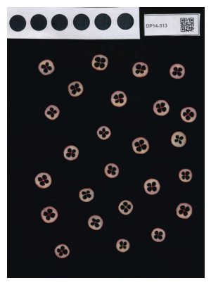
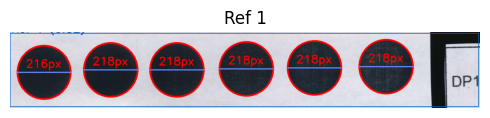
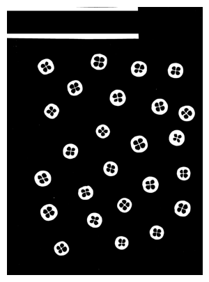
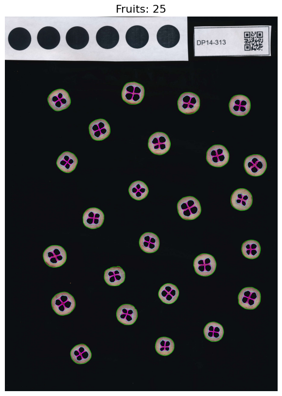
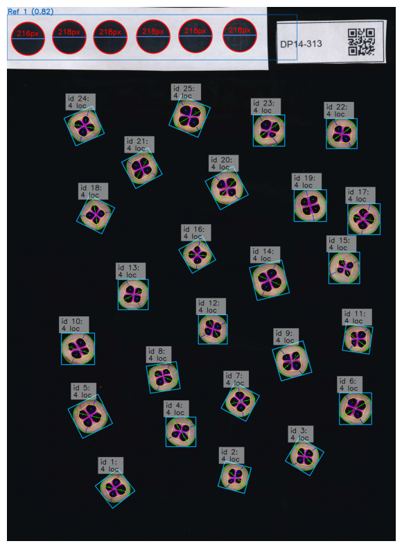
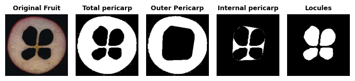

---
hide:
  - navigation
  - toc
---

<div style="text-align: center;" markdown>

# Internal Fruit Morphology Analysis in Cranberry

<p style="color:gray; margin-top: -35px; margin-bottom: 55px;" markdown>*Created by: María A. Torres-Meraz; Traitly v0.1.0 – April, 2026*</p>

</div>

In this tutorial, we demonstrate how to analyze the internal morphology of fruits using `FruitInternalAnalyzer`, a tool for extracting morphology and color measurements from cross-sectional images of cranberry slices.

!!! tip "Follow the tutorial"
    :fontawesome-solid-file-code: Download the Jupyter notebook and sample images for this tutorial [here](https://github.com/mariameraz/traitly/tree/main/tutorials_data/cranberry_internal_analysis).

!!! info "Methods and parameters reference"
    Throughout this tutorial we use methods such as `setup_measurements()`, `generate_fruit_mask()`, `detect_fruits()`, `analyze_morphology()`, and `analyze_color()`. For a full description of each method and its available parameters, refer to the [Internal Analyzer Class](../user_guide/internal_class.md).


The first step is to import `FruitInternalAnalyzer` from Traitly and create the `cranberry` object, which will contain everything needed for the analysis. The object can be named however you prefer.

We then initialize the class by specifying the image location through the `image_path` parameter.

```python
from traitly.fruit_phenotyping import FruitInternalAnalyzer
```

```python
path = "./cranberry_slices.jpg"
cranberry = FruitInternalAnalyzer(image_path = path)
```

First, we load the image into the object using `load_image()`. By default, the image will be displayed on screen (`plot=True`). Once loaded, it can be accessed through `cranberry.img`. For more details on the data stored in the object, refer to the [class attributes] section.

```python
cranberry.load_image() 
```



Next, we run `setup_measurements()` to define the diameter of the size references (black circles) and, optionally, read the QR code on the label. Setting `plot_reference=True` allows us to inspect the reference detection and the pixel diameter of each circle in detail.


As shown in the output, a strip of circles (`Ref 1`) composed of 6 circles was detected. Before computing the average, `setup_measurements()` removes any circles whose standard deviation exceeds 2, to avoid noise from poorly detected or atypical circles. In this case, 5 out of 6 circles were used, yielding a mean diameter of 218 px. This value is divided by the actual mean diameter in centimeters to obtain the pixel-per-cm density, which will be used to convert pixels to centimeters in subsequent analyses.

```python
cranberry.setup_measurements(detect_label = True,
                            diameter_cm = 1.7, 
                            plot_reference = True)
```

    =======================================================
    ★ LABEL DETECTION:
    =======================================================
    > QR Code detected: DP14-313 (0.14s)
    
    =======================================================
    ★ REFERENCE SIZE:
    =======================================================
    > Reference size detected:
      - Processing reference box(es) with a confidence threshold >=0.6:
                Ref 1: 1904x297 px, conf: 0.821
    
      - Total circles detected: 6
                Filtered circles: 5/6 (std > 2)
                Mean diameter: 218.0 ± 0.0 px
    
            . ݁₊ ⊹ . ݁ ⟡ ݁ px/cm density: 128.2 (diameter_cm: 1.7 cm) ⟡ ݁ . ⊹ ₊ ݁.



We then generate a binary mask of the fruits and locules using `generate_fruit_mask()`, where locules appear in black and the rest of the fruit in white.

```python
cranberry.generate_fruit_mask()
```



After that, we detect the fruits in the mask with `detect_fruits()` and do a quick visual inspection using `plot=True`. The image displays each fruit's outline in green, the locule contours in pink, and the internal pericarp area in cyan. This visualization allows you to verify the detection and determine whether any segmentation parameters need to be adjusted.

```python
cranberry.detect_fruits(plot = True,
                       plot_size = (10,10))
```

    =====================================
            . ݁₊ ⊹ . ݁ ⟡ ݁ Detected fruits: 25 ⟡ ݁ . ⊹ ₊ ݁.
    
     > Parameters used:
            - min_fruit_circularity: 0.5
            - min_locule_area: 50
            - min_locule_per_fruit: 1
            - min_fruit_area: 5000
    =====================================



We now run the morphological analysis with `analyze_morphology()`, which produces an annotated copy of the original image and a DataFrame with the results. In both outputs, each fruit is assigned a unique identifier (`id`) that is useful for cross-referencing the visualizations with the numerical data.

```python
cranberry.analyze_morphology()
```




<div>
<style scoped>
    .dataframe tbody tr th:only-of-type {
        vertical-align: middle;
    }

    .dataframe tbody tr th {
        vertical-align: top;
    }

    .dataframe thead th {
        text-align: right;
    }
</style>
<table border="1" class="dataframe">
  <thead>
    <tr style="text-align: right;">
      <th></th>
      <th>image_name</th>
      <th>label</th>
      <th>fruit_id</th>
      <th>n_locules</th>
      <th>unit</th>
      <th>fruit_area_cm2</th>
      <th>fruit_perimeter_cm</th>
      <th>fruit_circularity</th>
      <th>fruit_solidity</th>
      <th>fruit_convexity</th>
      <th>...</th>
    </tr>
  </thead>
  <tbody>
    <tr>
      <th>0</th>
      <td>cranberry_slices.jpg</td>
      <td>DP14-313</td>
      <td>1</td>
      <td>4</td>
      <td>cm</td>
      <td>1.688945</td>
      <td>5.019779</td>
      <td>0.842280</td>
      <td>0.988715</td>
      <td>0.927457</td>
      <td>...</td>
    </tr>
    <tr>
      <th>1</th>
      <td>cranberry_slices.jpg</td>
      <td>DP14-313</td>
      <td>2</td>
      <td>4</td>
      <td>cm</td>
      <td>1.491642</td>
      <td>4.738720</td>
      <td>0.834742</td>
      <td>0.987420</td>
      <td>0.921867</td>
      <td>...</td>
    </tr>
    <tr>
      <th>2</th>
      <td>cranberry_slices.jpg</td>
      <td>DP14-313</td>
      <td>3</td>
      <td>4</td>
      <td>cm</td>
      <td>1.637134</td>
      <td>4.970773</td>
      <td>0.832619</td>
      <td>0.988616</td>
      <td>0.920782</td>
      <td>...</td>
    </tr>
    <tr>
      <th>3</th>
      <td>cranberry_slices.jpg</td>
      <td>DP14-313</td>
      <td>4</td>
      <td>4</td>
      <td>cm</td>
      <td>1.831669</td>
      <td>5.227883</td>
      <td>0.842181</td>
      <td>0.988546</td>
      <td>0.925857</td>
      <td>...</td>
    </tr>
    <tr>
      <th>4</th>
      <td>cranberry_slices.jpg</td>
      <td>DP14-313</td>
      <td>5</td>
      <td>4</td>
      <td>cm</td>
      <td>2.280032</td>
      <td>5.840573</td>
      <td>0.839924</td>
      <td>0.988831</td>
      <td>0.924711</td>
      <td>...</td>
    </tr>
    <tr>
      <th>5</th>
      <td>cranberry_slices.jpg</td>
      <td>DP14-313</td>
      <td>6</td>
      <td>4</td>
      <td>cm</td>
      <td>2.128824</td>
      <td>5.763834</td>
      <td>0.805242</td>
      <td>0.986585</td>
      <td>0.907714</td>
      <td>...</td>
    </tr>
    <tr>
      <th>6</th>
      <td>cranberry_slices.jpg</td>
      <td>DP14-313</td>
      <td>7</td>
      <td>4</td>
      <td>cm</td>
      <td>1.692107</td>
      <td>5.080596</td>
      <td>0.823774</td>
      <td>0.987263</td>
      <td>0.916677</td>
      <td>...</td>
    </tr>
    <tr>
      <th>7</th>
      <td>cranberry_slices.jpg</td>
      <td>DP14-313</td>
      <td>8</td>
      <td>4</td>
      <td>cm</td>
      <td>1.726800</td>
      <td>5.223315</td>
      <td>0.795352</td>
      <td>0.982850</td>
      <td>0.907571</td>
      <td>...</td>
    </tr>
    <tr>
      <th>8</th>
      <td>cranberry_slices.jpg</td>
      <td>DP14-313</td>
      <td>9</td>
      <td>4</td>
      <td>cm</td>
      <td>2.144787</td>
      <td>5.860413</td>
      <td>0.784761</td>
      <td>0.986642</td>
      <td>0.894509</td>
      <td>...</td>
    </tr>
    <tr>
      <th>9</th>
      <td>cranberry_slices.jpg</td>
      <td>DP14-313</td>
      <td>10</td>
      <td>4</td>
      <td>cm</td>
      <td>2.161905</td>
      <td>5.699882</td>
      <td>0.836209</td>
      <td>0.989355</td>
      <td>0.922177</td>
      <td>...</td>
    </tr>
    <th>...</th>
    <td>...</td>
    <td>...</td>
    <td>...</td>
    <td>...</td>
    <td>...</td>
    <td>...</td>
    <td>...</td>
    <td>...</td>
    <td>...</td>
    <td>...</td>
    <td>...</td>
  </tbody>
</table>
<p>25 rows × 38 columns</p>
</div>

Alternatively, we can examine the tissue segmentation of a specific fruit in detail using `generate_single_fruit_masks()`. The `fruit_id` parameter lets us indicate exactly which fruit from the image or table we want to visualize.

```python
cranberry.generate_single_fruit_masks(fruit_id = 2)
```



Finally, we analyze the color of each fruit. By default, `analyze_color()` extracts color information from the `rgb`, `lab`, `hsv`, and `gray` channels for the `total_pericarp`, `outer_pericarp`, `internal_pericarp`, and `locules` tissues.

In this case, we will exclude the locules from the analysis, since being hollow, they only capture the black color of the background. To select specific tissues, we use the `tissue` parameter, and to select specific color channels, we use the `color_space` parameter.

When passing multiple values, they must be written as a comma-separated list, in lowercase, with spaces replaced by `_`. For example:

- RGB and HSV channels: `"rgb, hsv"`
- Locules, total pericarp, and outer pericarp tissues: `"locules, total_pericarp, outer_pericarp"`

If more granular control over which tissues to analyze is needed, the masks obtained with `generate_single_fruit_masks()` allow us to select only the most relevant tissues for the analysis.

```python
tissues_ext = "total_pericarp, outer_pericarp, internal_pericarp"

cranberry.analyze_color(tissue = tissues_ext,
                       color_space = "rgb")
```


<div>
<style scoped>
    .dataframe tbody tr th:only-of-type {
        vertical-align: middle;
    }

    .dataframe tbody tr th {
        vertical-align: top;
    }

    .dataframe thead th {
        text-align: right;
    }
</style>
<table border="1" class="dataframe">
  <thead>
    <tr style="text-align: right;">
      <th></th>
      <th>image_name</th>
      <th>label</th>
      <th>fruit_id</th>
      <th>tissue</th>
      <th>R_mean</th>
      <th>G_mean</th>
      <th>B_mean</th>
      <th>R_std</th>
      <th>G_std</th>
      <th>B_std</th>
    </tr>
  </thead>
  <tbody>
    <tr>
      <th>0</th>
      <td>cranberry_slices.jpg</td>
      <td>DP14-313</td>
      <td>1</td>
      <td>total_pericarp</td>
      <td>140.147522</td>
      <td>107.556854</td>
      <td>102.661514</td>
      <td>29.093695</td>
      <td>35.751049</td>
      <td>31.698030</td>
    </tr>
    <tr>
      <th>1</th>
      <td>cranberry_slices.jpg</td>
      <td>DP14-313</td>
      <td>1</td>
      <td>internal_pericarp</td>
      <td>139.475250</td>
      <td>100.753677</td>
      <td>95.946632</td>
      <td>29.493685</td>
      <td>43.233368</td>
      <td>39.668324</td>
    </tr>
    <tr>
      <th>2</th>
      <td>cranberry_slices.jpg</td>
      <td>DP14-313</td>
      <td>1</td>
      <td>outer_pericarp</td>
      <td>142.934784</td>
      <td>111.056740</td>
      <td>105.959541</td>
      <td>26.142126</td>
      <td>32.451111</td>
      <td>28.258091</td>
    </tr>
    <tr>
      <th>3</th>
      <td>cranberry_slices.jpg</td>
      <td>DP14-313</td>
      <td>2</td>
      <td>total_pericarp</td>
      <td>148.301102</td>
      <td>119.346420</td>
      <td>105.754677</td>
      <td>27.769527</td>
      <td>30.698967</td>
      <td>26.121008</td>
    </tr>
    <tr>
      <th>4</th>
      <td>cranberry_slices.jpg</td>
      <td>DP14-313</td>
      <td>2</td>
      <td>internal_pericarp</td>
      <td>145.619812</td>
      <td>122.564034</td>
      <td>102.932617</td>
      <td>19.196663</td>
      <td>18.638998</td>
      <td>24.833715</td>
    </tr>
    <tr>
      <th>...</th>
      <td>...</td>
      <td>...</td>
      <td>...</td>
      <td>...</td>
      <td>...</td>
      <td>...</td>
      <td>...</td>
      <td>...</td>
      <td>...</td>
      <td>...</td>
    </tr>
    <tr>
      <th>70</th>
      <td>cranberry_slices.jpg</td>
      <td>DP14-313</td>
      <td>24</td>
      <td>internal_pericarp</td>
      <td>147.718323</td>
      <td>114.503822</td>
      <td>107.229797</td>
      <td>28.367800</td>
      <td>36.551113</td>
      <td>33.617943</td>
    </tr>
    <tr>
      <th>71</th>
      <td>cranberry_slices.jpg</td>
      <td>DP14-313</td>
      <td>24</td>
      <td>outer_pericarp</td>
      <td>147.333191</td>
      <td>117.123642</td>
      <td>111.132996</td>
      <td>29.128061</td>
      <td>32.934532</td>
      <td>28.674442</td>
    </tr>
    <tr>
      <th>72</th>
      <td>cranberry_slices.jpg</td>
      <td>DP14-313</td>
      <td>25</td>
      <td>total_pericarp</td>
      <td>147.192123</td>
      <td>114.394127</td>
      <td>100.128860</td>
      <td>29.666571</td>
      <td>34.832909</td>
      <td>29.787176</td>
    </tr>
    <tr>
      <th>73</th>
      <td>cranberry_slices.jpg</td>
      <td>DP14-313</td>
      <td>25</td>
      <td>internal_pericarp</td>
      <td>147.941788</td>
      <td>121.066788</td>
      <td>101.173103</td>
      <td>24.562567</td>
      <td>26.238270</td>
      <td>26.743542</td>
    </tr>
    <tr>
      <th>74</th>
      <td>cranberry_slices.jpg</td>
      <td>DP14-313</td>
      <td>25</td>
      <td>outer_pericarp</td>
      <td>150.031143</td>
      <td>115.447060</td>
      <td>102.027443</td>
      <td>27.291199</td>
      <td>34.938839</td>
      <td>28.972141</td>
    </tr>
  </tbody>
</table>
<p>75 rows × 10 columns</p>
</div>


Once `analyze_morphology()` and/or `analyze_color()` have been run, the `results` object becomes available. It holds all analysis outputs along with the methods needed to export them. To save everything in one step, use `save_all()` as shown below.

```python
cranberry.results.save_all()

## Alternatives:
# cranberry.results.save_img() # Saves only the annotated image
# cranberry.results.save_csv() # Saves only the generated CSV file(s)
```

    > Results saved at:
        – Image: /Users/traitly/tutorials_data/internal_analysis/cranberry_slices_annotated.jpg
        – Morphology CSV: /Users/traitly/tutorials_data/internal_analysis/cranberry_slices_morphology_results.csv
        – Color CSV: /Users/traitly/tutorials_data/internal_analysis/cranberry_slices_color_results.csv

We can also export the parameters used during the session with `save_parameters()`, which generates two files: a `.txt` and a `.json`. The `.txt` file is intended for the user and includes the parameters for each method, the Traitly version, the date and time of the analysis, and the image name. The `.json` file, on the other hand, is useful for replicating the analysis — for instance, when processing multiple images with `analyze_folder()` or when running Traitly from the command line.

```python
cranberry.save_parameters()
```

    > Parameters saved at:
      - TXT:  /Users/traitly/tutorials_data/internal_analysis/cranberry_slices_parameters.txt
      - JSON: /Users/traitly/tutorials_data/internal_analysis/cranberry_slices_parameters.json


## What's next?

- [How to run a batch analysis](batch_tutorial.md) – analyzing the external appearance of multiple images.
- [Traits Table](../user_guide/results/measurements.md) – what each CSV column means.
- [Internal Analysis Guide](../user_guide/internal_class.md) — a detailed guide covering all available parameters and methods for `FruitInternalAnalyzer`.

<div style="text-align: center;" markdown>

[← Back to Tutorials](overview.md){ .md-button }

</div>
