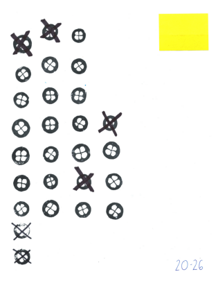
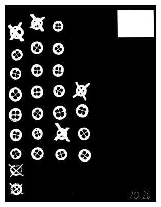
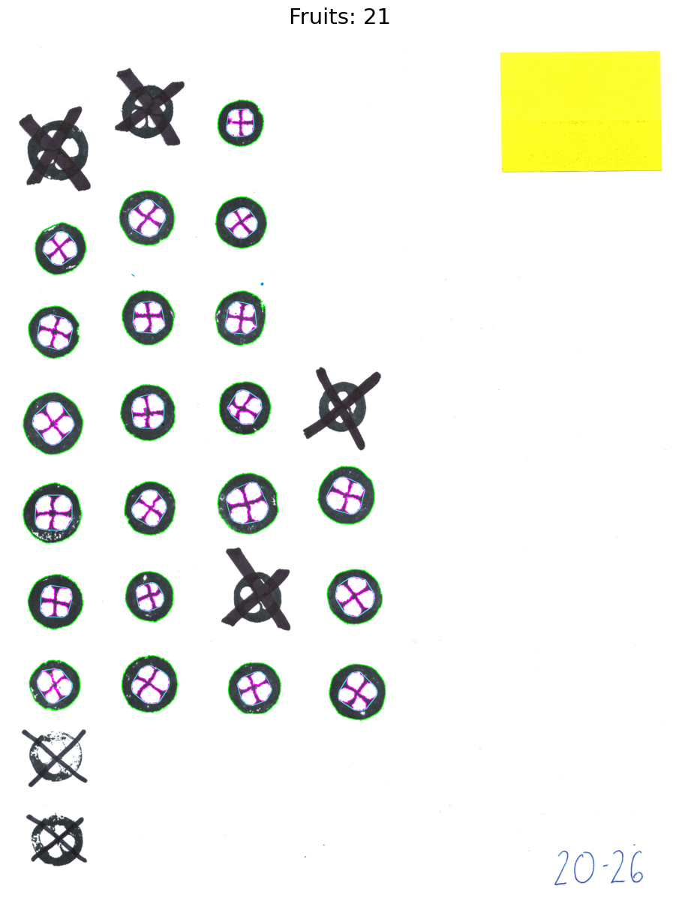
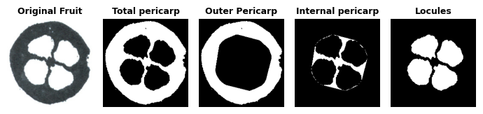
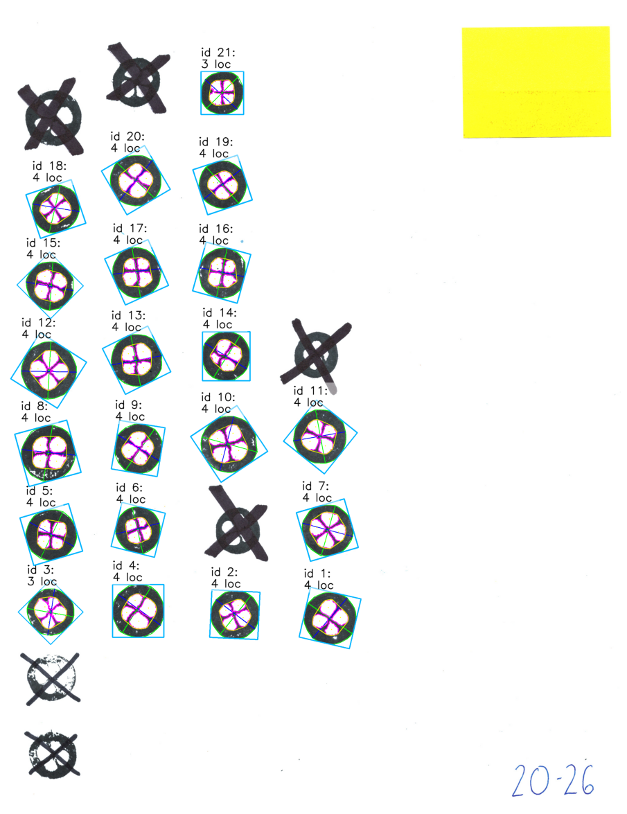

---
hide:
  - navigation
  - toc
---

<div style="text-align: center;" markdown>

# Internal Fruit Morphology Analysis in Cranberry – Stamps

<p style="color:gray; margin-top: -35px; margin-bottom: 55px;" markdown>*Created by: María A. Torres-Meraz; Traitly v0.1.0 – April, 2026*</p>

</div>

In this tutorial, we will demonstrate how to analyze the internal morphology of cranberry fruits using stamp images with `FruitInternalAnalyzer`. Here we will focus on which parameters to adjust when working with this type of image. For a more detailed review of each method and a complete analysis with `FruitInternalAnalyzer`, see the [Morphology and Color Analysis in Cranberry](./cranberry_internal_analysis.md) tutorial.

!!! tip "Follow along"
    :fontawesome-solid-file-code: Download the Jupyter notebook and sample images for this tutorial [here](https://github.com/mariameraz/traitly/tree/main/tutorials/cranberry_stamp_analysis).


The first step is to initialize the `FruitInternalAnalyzer` class and load our image.

```python
# Import the class
from traitly.fruit_phenotyping import FruitInternalAnalyzer
```

```python
# Create the `cranberry` object
input_path = "./cranberry_stamps.jpg"
cranberry = FruitInternalAnalyzer(path)

# Load our image
cranberry.load_image()
```
    


When making stamps, some of them may have errors that make analysis difficult. There are several ways to remove those fruits from the image: one option is to manually remove the faulty stamps from the mask using `cranberry.edit_mask()`, or more simply, marking the stamp with an X. This is done with the intention of later filtering these fruits based on their circularity in `cranberry.detect_fruits`. In this example, we follow the latter approach.

Even though the image does not include a size reference, we can still convert pixels to centimeters if we know the dimensions of the scanned sheet in centimeters. The measurements are passed as shown below:

```python
cranberry.setup_measurements(width_cm = 21.6, 
                             length_cm = 27.9)
```

    
    =======================================================
    ★ LABEL DETECTION:
    =======================================================
    > Label detection: SKIPPED (detect_label=False)
    
    =======================================================
    ★ REFERENCE SIZE:
    =======================================================
    > Size reference detection: SKIPPED (skip_yolo=True).
    
    > Using provided physical dimensions:
        - width_cm:  21.6 cm
        - length_cm: 27.9 cm
    
            . ݁₊ ⊹ . ݁ ⟡ ݁ px/cm density: 115.26 ⟡ ݁ . ⊹ ₊ ݁.


We will now generate the binary mask, which separates the background from the other objects in the image. By default, `generate_fruit_mask` expects a black background, but stamp images have a white background. In this case, we will use the `stamp=True` parameter, which instructs `generate_fruit_mask` to invert the image colors before generating the mask, so that the white paper becomes black and the mask can correctly segment the background from the stamps.

```python
cranberry.generate_fruit_mask(stamp = True)
```


    
With the mask ready, we can proceed as with any other image type, detecting fruits with `detect_fruits`. If the stamps contain small ink-free gaps, these could introduce noise in locule detection, which can be addressed by adjusting `min_locule_area`.

As we can see in the results, stamps marked with a cross were not detected as fruits, thanks to filtering contours by circularity with `min_fruit_circularity=0.5`.


```python
cranberry.detect_fruits(plot = True, 
                        plot_size = (15,15),
                        min_locule_area = 300)
```

    
    =====================================
            . ݁₊ ⊹ . ݁ ⟡ ݁ Detected fruits: 21 ⟡ ݁ . ⊹ ₊ ݁.
    
     > Parameters used:
            - min_fruit_circularity: 0.5
            - min_locule_area: 300
            - min_locule_per_fruit: 1
            - min_fruit_area: 5000
    =====================================

    


With the fruits detected, we perform the morphological analysis with `analyze_morphology`.

In some cases, stamp contours may not be well defined, which can affect morphology results by underestimating measurements such as area, circularity, perimeter, etc. We can see a more detailed example in fruit 15.


```python
# Analyze fruit morphology
cranberry.analyze_morphology(display_table = False, plot_size = (15,15))

# Visualize stamp no. 15
cranberry.generate_single_fruit_masks(fruit_id = 15)
```
    


    

  
For these situations, instead of using the original stamp contour (`contour_mode='raw'`), we can apply a transformation with `contour_mode='hull'`, which applies a convex hull using the [cv2](https://docs.opencv.org/4.x/d3/dc0/group__imgproc__shape.html#ga014b28e56cb8854c0de4a211cb2be656) library, correcting the indentations in the stamps. This method takes all the points that define the original contour of a fruit and finds a new contour that wraps them convexly. You can think of it as stretching a rubber band around the fruit, "filling in" the gaps in the stamp's perimeter, as can be seen in detail in stamp 15 reviewed previously.

```python
cranberry.analyze_morphology(display_table = False,
                             contour_mode = 'hull', 
                             plot_size = (15,15))
```

    

    

This concludes the analysis! We can now proceed to save the results.

```python
cranberry.results.save_all()
```

    > Results saved at:
        – Image: /Users/traitly/tutorials/cranberry_stamp_analysis/cranberry_stamps_processed.jpg
        – Morphology CSV: /Users/traitly/tutorials/cranberry_stamp_analysis/cranberry_stamps_morphology_results.csv


## What's next?

- [How to run batch processing](batch_tutorial.md) – analyzing the external appearance of multiple images.
- [Traits Table](../user_guide/results/measurements.md) – what each column in the CSV means.
- [Internal Analysis Guide](../user_guide/internal_class.md) — detailed guide with all available parameters and methods for `FruitInternalAnalyzer`.

<div style="text-align: center;" markdown>

[← Back to Tutorials](overview.md){ .md-button }

</div>
