---
hide:
  - navigation
  - toc
---

<div style="text-align: center;" markdown>

# Locule Segmentation

<p style="color:gray; margin-top: -35px; margin-bottom: 55px;" markdown>
    *Created by: María A. Torres-Meraz; Traitly v0.1.0 – March, 2026*
</p>

</div>

In this tutorial we'll go over how to segment fruits with complex locules using `FruitInternalAnalyzer`:

!!! tip "Follow along"
    :fontawesome-solid-file-code: Download the Jupyter notebook and sample images for this tutorial [here](https://github.com/mariameraz/traitly/tree/main/tutorials/segmentate_locules).

```python
# Import External Analysis Class
from traitly.fruit_phenotyping import FruitInternalAnalyzer
```

In `FruitInternalAnalyzer`, fruit and locule contours are detected through hierarchical contour segmentation using [`cv2.RETR_TREE`](https://docs.opencv.org/4.x/d9/d8b/tutorial_py_contours_hierarchy.html), which identifies and organizes nested contours — that is, contours within contours. In this scheme, the outer fruit contour acts as the parent contour, while the internal locules are detected as child contours, as shown in the image. For this reason, `detect_fruits()` expects the fruit area to be white and the locules to be black in the binary mask.

<div style="text-align: center;" markdown>

</div>


This tutorial covers three examples with increasing segmentation complexity:

| Example | Fruit | Challenge |
|---------|-------|-----------|
| [Tomato – Example 1](#tomato-example-1) | Tomato | Clear contrast between locules and pericarp |
| [Tomato – Example 2](#tomato-example-2) | Tomato | Overlapping pixel intensities — using CLAHE and manual editing |
| [Dragon fruit](#dragon-fruit) | Dragon fruit | Locules are lighter than the surrounding tissue |


# Tomato – Example 1

For our first example we'll use a tomato image. Since the image contains a single fruit with a lot of empty space around it, we'll start by cropping it using the `x`, `y`, `w`, and `h` parameters of `load_image()`. While this step is optional, it helps reduce memory usage and speeds up processing by limiting contour detection to the area of interest.


```python
input_path = "./tomato_2.tif"
tomato = FruitInternalAnalyzer(input_path)
tomato.load_image()
```


    
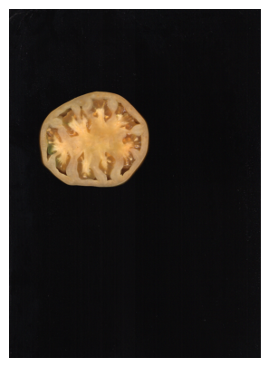
    


```python
tomato.load_image(show_axis = True, x = 250, y = 750, h = 1050, w = 1150)
```


    
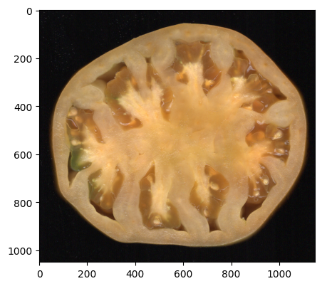
    


Next, we generate a mask to segment the fruit with `generate_fruit_mask()`. As expected, since we're only removing the background, everything that isn't background appears white in this first mask, with no distinction between the pericarp and the locules.


```python
tomato.generate_fruit_mask()
```


    
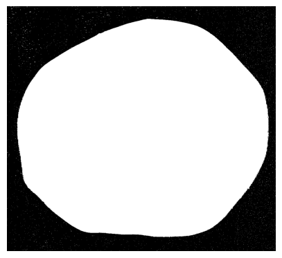
    


In these cases, we need to create an additional locule mask based on an intensity threshold on the L channel (lightness) of the LAB color space, where darker pixels correspond to locules and lighter pixels to the rest of the fruit. `FruitInternalAnalyzer` internally converts the image from BGR to LAB and extracts the L channel, so we can go straight to `generate_locule_mask()`. However, when the contrast between the pericarp and the locules isn't sufficient for a good segmentation, we can improve it beforehand with `enhance_locule_contrast()`, which allows applying one of three transformations to the L channel: `'gamma'`, `'sigmoid'`, or `'exp'` (exponential). For more details on how both methods work, see the [Internal Analyzer Class](../user_guide/internal_class.md#enhance_locule_contrast) section.

The `compare_method=True` parameter generates a side-by-side comparison showing the result of all three transformations against the original image, using default values that can be adjusted with the corresponding parameters. This makes it easier to choose the most suitable method before applying it.


```python
tomato.enhance_locule_contrast(compare_method = True, plot_size = (5,5))
```


    
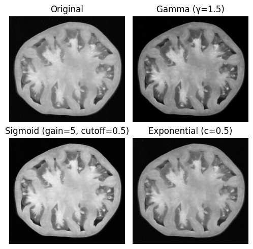
    


By default, `enhance_locule_contrast(compare_method=True)` only displays the plot but does not apply any transformation to the image unless a method is specified with `contrast_method`. Once you've chosen a method, run `enhance_locule_contrast()` again, this time passing your chosen method instead of `compare_method`.

For this example we'll use `contrast_method='gamma'`.


```python
tomato.enhance_locule_contrast(contrast_method = 'gamma', 
                               gamma = 1.8,
                               plot_size = (5,5))
```


    
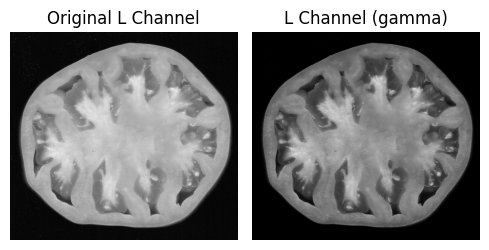
    


Once the contrast is applied, we generate the locule mask with `generate_locule_mask()`. This function binarizes the transformed L channel using `thresh_min` to select the dark pixels corresponding to the locules, then internally combines this mask with the fruit mask to produce a final mask in the expected format. When `plot=True` (default), both the intermediate locule mask and the final combined mask are displayed.


```python
tomato.generate_locule_mask(plot_size = (8,5))
```


    
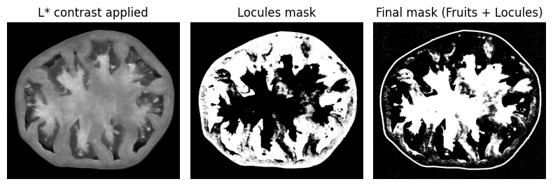
    


For this fruit, the default `thresh_min` value doesn't capture the locules well, so we need to adjust this threshold. To guide this choice, we can use `generate_l_channel_histogram()`.

!!! note "Prerequisites"
    `generate_l_channel_histogram()` requires both `generate_fruit_mask()` and `enhance_locule_contrast()` to have been run first.

This method generates two **histograms of the L channel pixel distribution**, restricted to pixels within the fruit mask. The left histogram shows the **full L channel distribution**, and the right one shows the **same distribution split by the Otsu threshold** (see [Otsu Binarization](https://docs.opencv.org/4.x/d7/d4d/tutorial_py_thresholding.html) for more details), where the dashed line indicates a possible cutoff value between locules and pericarp. With `otsu_offset` you can shift this line left or right to find the point that best separates both populations.

The value identified in the histogram can be used in two ways in `generate_locule_mask()`: directly as `thresh_min` to filter pixels from the L channel image, or by passing `otsu_offset` so that Otsu binarization is applied internally and adjusted to the identified value.

Here, both histograms show a bimodal distribution: the first mode, with a mean around 70, corresponds to the dark locule pixels, while the second, with a mean around 120, corresponds to the lighter pericarp pixels. Since the separation between both populations is clearer in the Otsu histogram, we opted to use `otsu_offset` instead of `thresh_min` directly. We selected `otsu_offset=15` as a starting point, as it positions the dashed line better in the valley between both modes.


```python
tomato.generate_l_channel_histogram(otsu_offset = 15, plot_size = (9,3))
```


    
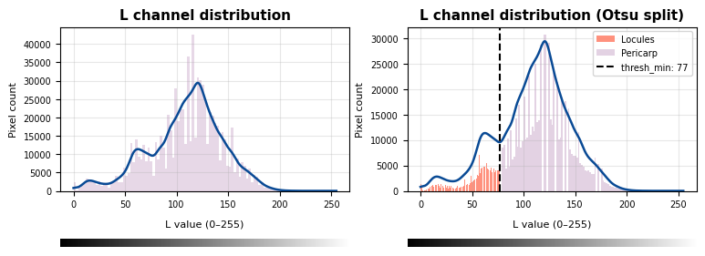
    


We ended up using `otsu_offset=15`, fine-tuning the Otsu threshold until we were happy with the final mask.


```python
tomato.generate_locule_mask(otsu_offset = 15)
```


    
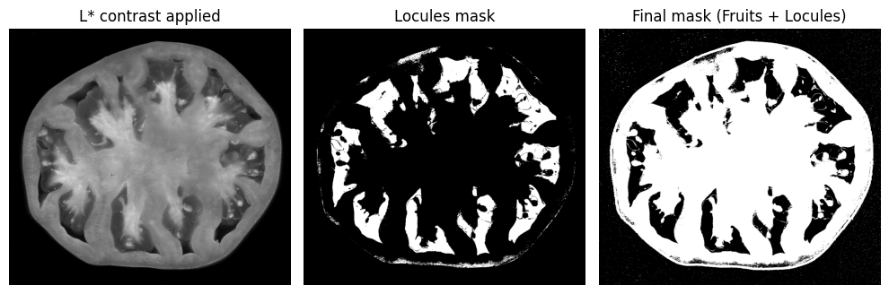
    


Optionally, you can use `erosion_px` to apply an erosion to the fruit mask and remove noise along the borders.


```python
tomato.generate_locule_mask(otsu_offset = 25,
                            erosion_px = 45)
```


    
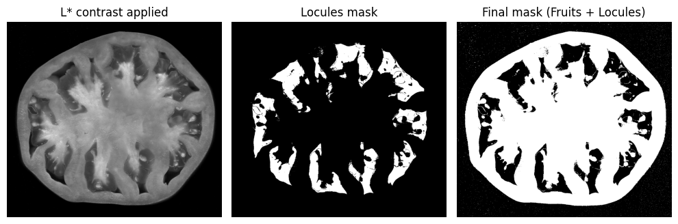
    


We verify the locule contours with `detect_fruits()` and filter out small contours with `min_locule_area`.


```python
tomato.detect_fruits(plot = True, min_locule_area = 100)
```

    
    =====================================
            . ݁₊ ⊹ . ݁ ⟡ ݁ Detected fruits: 1 ⟡ ݁ . ⊹ ₊ ݁.
    
     > Parameters used:
            - min_fruit_circularity: 0.5
            - min_locule_area: 100
            - min_locule_per_fruit: 1
            - min_fruit_area: 5000
    =====================================


    
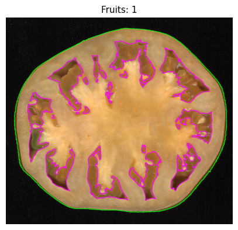
    


With `generate_single_fruit_masks()` we can take a closer look at the tissue segmentation:


```python
tomato.generate_single_fruit_masks()
```


    
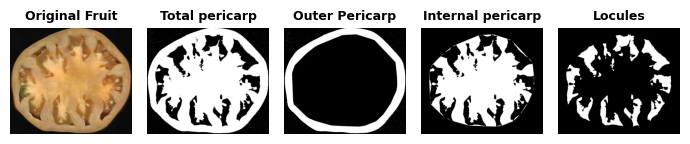
    


With the mask ready, we can move on to color and morphology analysis.

As we can see in the results, with this type of mask the number of locules can sometimes be overestimated because some appear fragmented. For this reason, individual locule-level metrics won't be reliable; however, metrics like total locule area and all those related to the pericarp and fruit as a whole are valid.


```python
tomato.analyze_morphology(plot_size = (4,4))
```


    
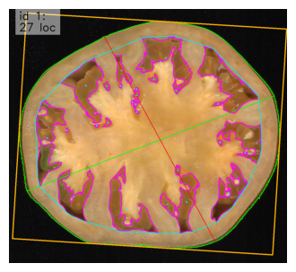
    


As for color analysis, locule fragmentation doesn't affect the results since the color is quantified across the total locule area.


```python
tomato.analyze_color(color_space = 'rgb')
```


```python
from traitly.fruit_phenotyping import plot_tissue_colors
df = tomato.results.color_results

plot_tissue_colors(df)
```


    
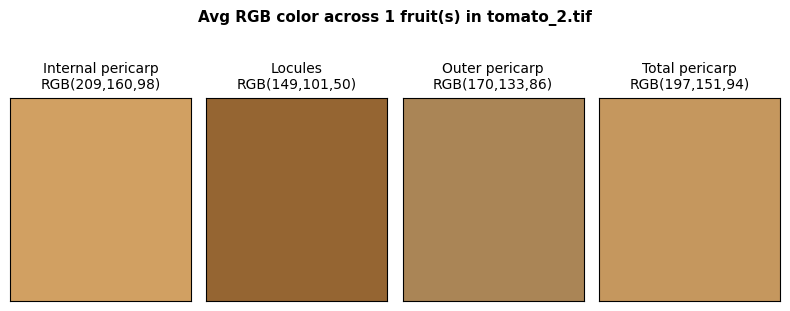
    


# Tomato – Example 2

In the previous example, the locules were significantly darker than the rest of the fruit, but in more complex images some regions of the pericarp can have a similar intensity to the locules, as in this other tomato image.

Just like before, we start by generating the fruit mask with `generate_fruit_mask()`.


```python
input_path = "./tomato_1.tif"
tomato = FruitInternalAnalyzer(input_path)
tomato.load_image(show_axis = True, x = 400, y = 500, w = 1200, h = 1200)
tomato.generate_fruit_mask()
```


    
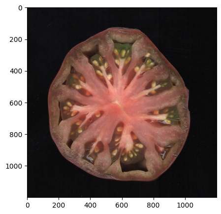
    


    
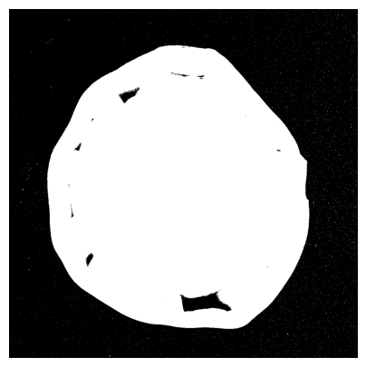
    


When checking `compare_method=True`, we can see that some pericarp pixels have a similar intensity to the locules, meaning the transformations covered earlier may not be enough for a good segmentation. This is also reflected in the histogram: unlike the previous example, both pixel populations overlap considerably, making it hard to find a clear threshold to separate them.


```python
tomato.enhance_locule_contrast(compare_method = True, plot_size = (5,5))
```


    
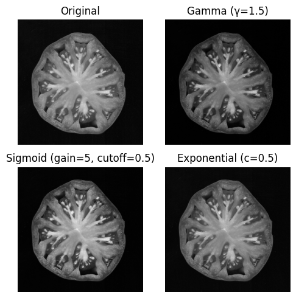
    


```python
tomato.generate_l_channel_histogram()
```


    
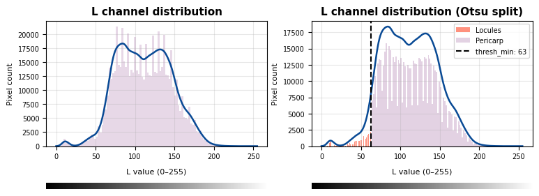
    


For these cases, `enhance_locule_contrast()` offers the option to apply **CLAHE** (*Contrast Limited Adaptive Histogram Equalization*), a variant of histogram equalization that operates locally on small image regions (*tiles*), improving contrast in specific areas without amplifying it globally. It is controlled by two parameters: `clip_limit`, which sets the maximum contrast amplification (higher values produce stronger contrast but can introduce more noise), and `tile_grid_size`, which determines the size of the local regions (higher values consider larger areas, moving closer to a global equalization). CLAHE can be applied on its own or combined with any of the transformation methods (`'gamma'`, `'sigmoid'`, `'exp'`), in which case it is applied on the already-transformed image. If no `contrast_method` is specified, CLAHE is applied directly on the original L channel.


```python
tomato.enhance_locule_contrast(
    contrast_method='none',
    clip_limit=10,
    tile_grid_size=5
)
```


    
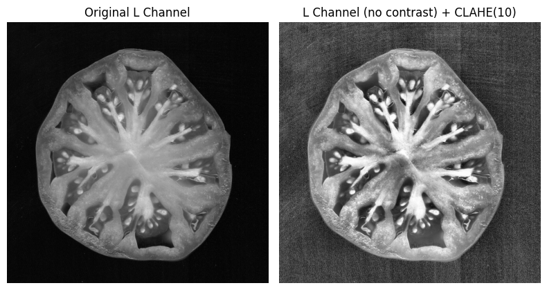
    


When CLAHE is applied, the pixel distribution in the histogram changes considerably compared to the original image, which can affect the threshold calculated by Otsu. For this reason, instead of relying on `otsu_offset`, we'll adjust `clip_limit` and `tile_grid_size` until we get the best separation between both populations in the histogram, and use that value directly as `thresh_min` in `generate_locule_mask()`.


```python
tomato.generate_l_channel_histogram()
```


    
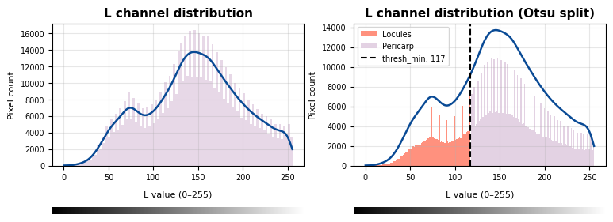
    


The resulting mask captures most of the locules, though some noise remains that is hard to remove with thresholds alone. To fix this, we can use `edit_mask()`, which opens an interactive editor to manually add or remove regions from the mask (see [Internal Fruit Analyzer](../user_guide/internal_class.md#edit_mask) for more details).


```python
tomato.generate_locule_mask(thresh_min = 90, min_locule_area = 50)
```


    
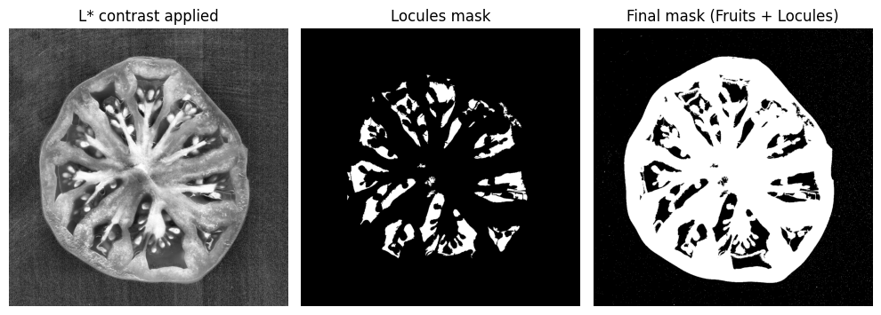
    


```python
tomato.edit_mask()
```


<pre style='font-family:monospace'>============================================================<br> .✦ ݁˖ Interactive mask editor .✦ ݁˖<br>============================================================<br>> Draw polygons to add or remove regions.<br>> Editing: mask_locules
<br>  Left click        : add polygon point (both panels)<br>  Right click drag  : pan<br>  W                 : fill polygon WHITE (add region)<br>  B                 : fill polygon BLACK (remove region)<br>  Enter             : apply current polygon<br>  Z                 : undo last edit<br>  C                 : clear current polygon points<br>  + / =             : zoom in<br>  - / _             : zoom out<br>  T                 : toggle overlay opacity (10% steps)<br>  Q                 : quit and SAVE changes<br>  ESC               : quit and DISCARD all changes</pre>


The mask corrected with `edit_mask()` is saved as `mask_locules`. We can visualize it with `matplotlib`:


```python
import matplotlib.pyplot as plt

plt.imshow(tomato.mask_locules, cmap = 'gray')
plt.axis('off')
plt.show()
```


    
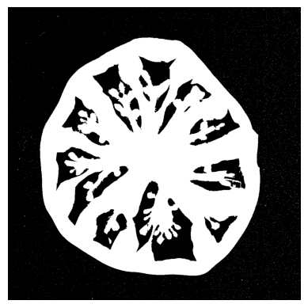
    


```python
tomato.detect_fruits(plot = True, min_locule_area = 100)
```

    
    =====================================
            . ݁₊ ⊹ . ݁ ⟡ ݁ Detected fruits: 1 ⟡ ݁ . ⊹ ₊ ݁.
    
     > Parameters used:
            - min_fruit_circularity: 0.5
            - min_locule_area: 100
            - min_locule_per_fruit: 1
            - min_fruit_area: 5000
    =====================================


    
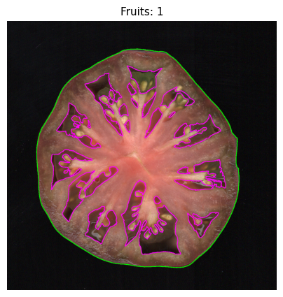
    


# Dragon fruit

In `traitly`, locules are defined as the internal fruit cavities surrounded by pericarp tissue. However, `generate_locule_mask()` can also be used to segment other internal tissues, such as dragon fruit pulp, even if these aren't technically locules.

We'll follow the same steps as before: loading the image and generating the fruit mask with `generate_fruit_mask()`.


```python
input_path = './dragon_fruit.tif'

dragon_fruit = FruitInternalAnalyzer(input_path)
dragon_fruit.load_image(show_axis = True, 
                        x = 400, y = 400, h = 1300, w = 1400)
dragon_fruit.generate_fruit_mask()
```


    
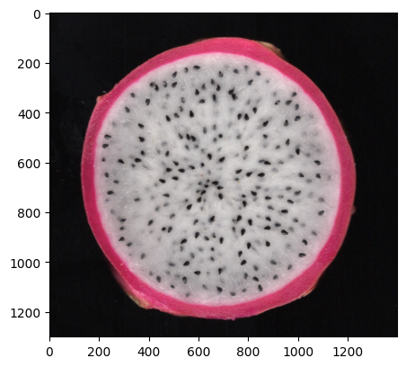
    


    
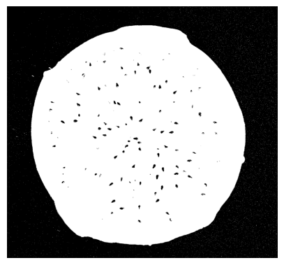
    


When checking `compare_method=True`, the contrast transformation methods do improve the separation between pulp and skin slightly, but the original image is sufficient to move forward, so we won't apply any additional transformation. Since no `contrast_method` is specified, no transformation is applied, and we can proceed directly with `generate_l_channel_histogram()` and `generate_locule_mask()`.


```python
dragon_fruit.enhance_locule_contrast(compare_method = True, plot_size = (5,5))
```


    
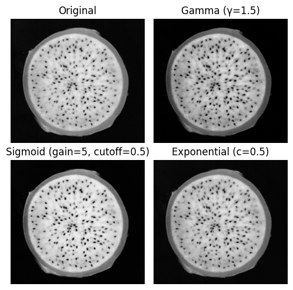
    


Looking at the histogram with `generate_l_channel_histogram()`, the separation between dark and light pixels is clear in both plots, so we'll use `thresh_min=150` directly.


```python
dragon_fruit.generate_l_channel_histogram(otsu_offset = 60)
```


    
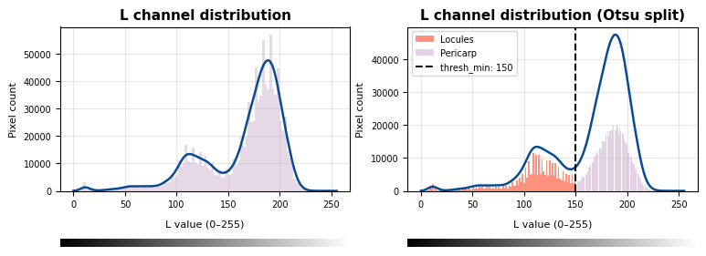
    


```python
dragon_fruit.generate_locule_mask(thresh_min = 150)
```


    
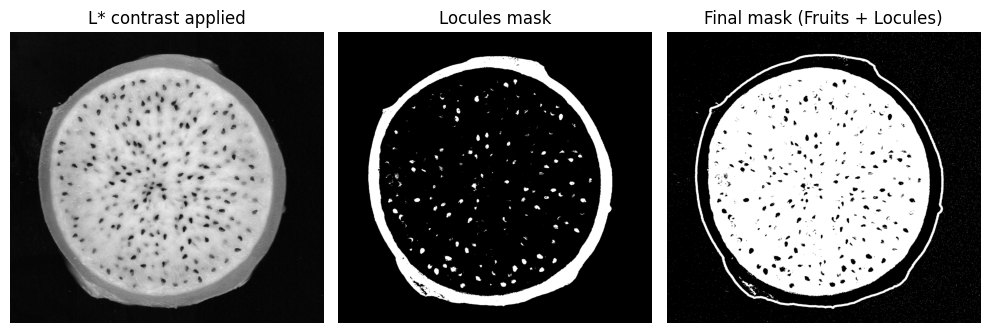
    


Unlike the previous examples, in this image the pulp is lighter than the rest of the fruit. Since `generate_locule_mask()` expects locules to be darker, we use `invert_locule=True` to invert the locule mask before combining it with the fruit mask. In the final mask, the pulp will appear black and the rest of the fruit white.


```python
dragon_fruit.generate_locule_mask(thresh_min = 150, invert_locule = True, min_locule_area = 500)
```
    
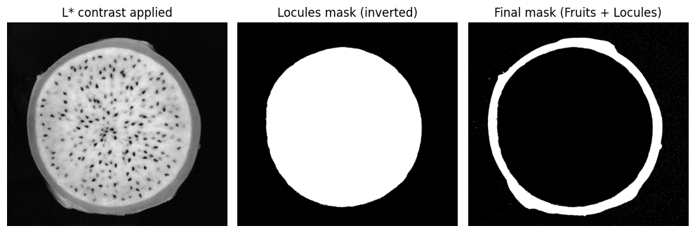
    

```python
dragon_fruit.detect_fruits(plot = True, pericarp_int_color = (255,255,0))
```

    
    =====================================
            . ݁₊ ⊹ . ݁ ⟡ ݁ Detected fruits: 1 ⟡ ݁ . ⊹ ₊ ݁.
    
     > Parameters used:
            - min_fruit_circularity: 0.5
            - min_locule_area: 50
            - min_locule_per_fruit: 1
            - min_fruit_area: 5000
    =====================================

 
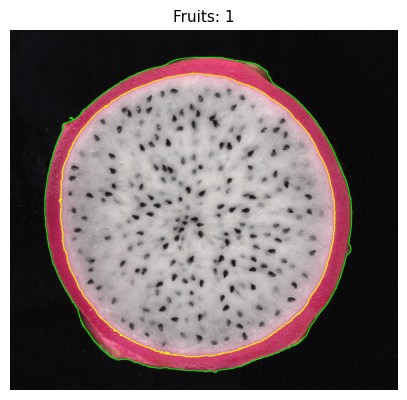
    
We can now move on to `analyze_morphology()` and/or `analyze_color()`.

Since there is only one 'locule' covering the entire pulp region, before running `analyze_color()` we can check the tissue segmentation with `generate_single_fruit_masks()` and select only the relevant tissues. For this fruit, we'll work with `'total_pericarp'` and `'locules'` only, as the other tissues aren't meaningful in this case.

```python
dragon_fruit.generate_single_fruit_masks()
```
    
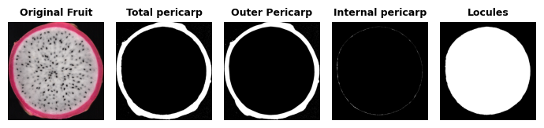

By default, `analyze_color()` excludes pixels with a lightness value below 20 (`dark_thresh=20`) to avoid noise from the background or very dark elements like seeds. For this image, this threshold is enough to remove seed color and background noise. If you need to adjust it for other images, `plot_dark_threshold()` shows the pixel distribution across the entire fruit section to help identify the best cutoff value, which can then be passed directly with `dark_thresh` in `analyze_color()`.

```python
from traitly.fruit_phenotyping import plot_dark_threshold

img = dragon_fruit.img
mask = dragon_fruit.mask_fruit
plot_dark_threshold(img, mask, dark_threshold = 20)
```
    
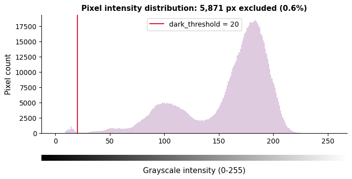
    

Finally, we extract color metrics for the RGB channels with `analyze_color()` and visualize the mean color for each analyzed tissue.

```python
dragon_fruit.analyze_color(tissue = 'outer_pericarp, locules', 
                           dark_thresh = 20,
                           color_space = 'rgb')
```

```python
from traitly.fruit_phenotyping import plot_tissue_colors

df = dragon_fruit.results.color_results

plot_tissue_colors(df, 
                   plot_size = (5,3))
```
    
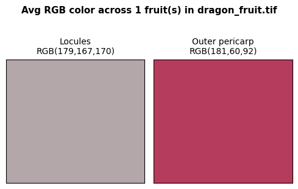

## What's next?

- [Internal Analysis Guide](../user_guide/internal_class.md) — detailed guide with all available parameters and methods for `FruitInternalAnalyzer`.
- [External Analysis Guide](../user_guide/external_class.md) — detailed guide with all available parameters and methods for `FruitExternalAnalyzer`.
- [External Analysis Tutorial](individual_img_tutorial.md) — analyzing an image step by step.
- [Traits Table](../user_guide/results/measurements.md) — what each column in the CSV means.

<div style="text-align: center;" markdown>

[← Back to Tutorials](overview.md){ .md-button style="background-color: black; color: white; border-color: black;" }

</div>
