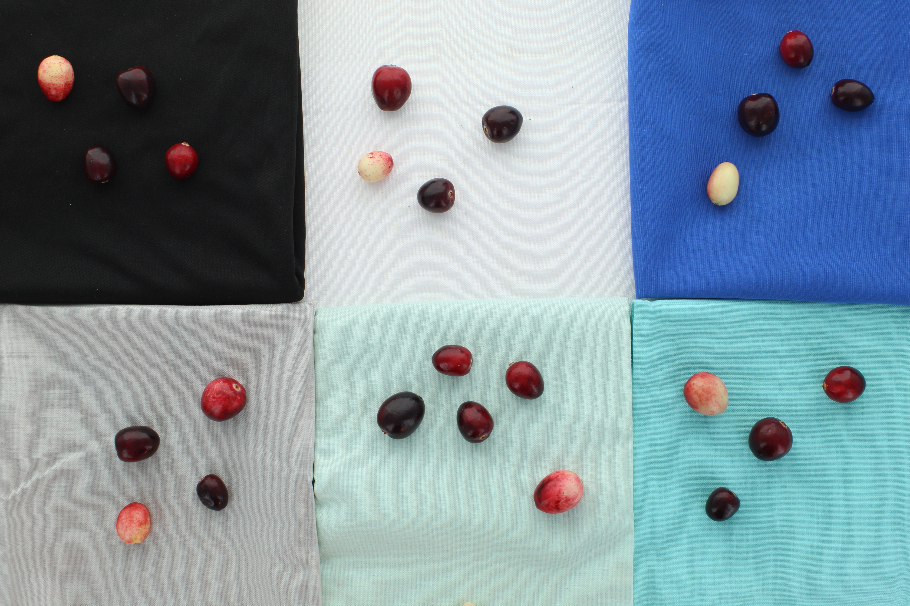
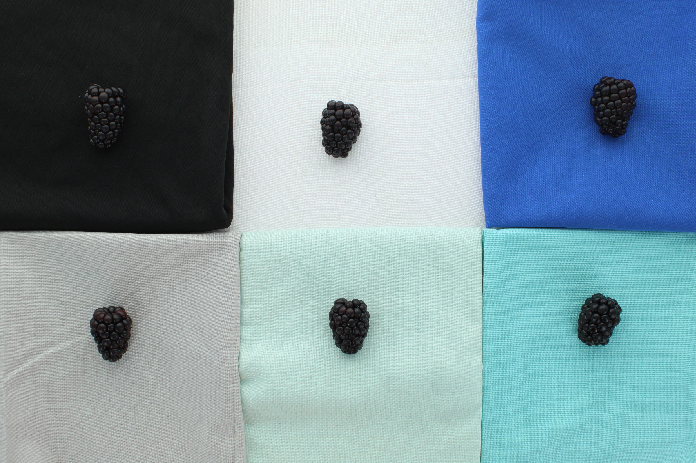

<div class="animate" markdown>

# Image Specifications

Analysis quality depends directly on image quality. Traitly is designed to be robust, but following these recommendations will ensure the best results.

---

## 1. Image Acquisition

### 1.1 Recommended Equipment

For external fruit analysis, images can be captured with either a smartphone or a professional camera. Regardless of the device used, consistency is key. Use the **same device** for all images in an experiment, as color adjustments, white balance, and internal processing vary between manufacturers and models, and these differences can introduce bias in color measurements. 


### 1.2 Sample Preparation

- **Camera position**: Mount or secure the camera so it is **parallel** and **perpendicular** to the fruits, with no tilt or angle. Shooting at an angle introduces geometric distortion that can affect morphological measurements. We also recommend keeping the camera **fixed on a stand** throughout the experiment to ensure the same distance between the lens and the background in every image.
- **Non-fruit objects**: Keep images as clean as possible (e.g., stems, leaves, loose seeds, or debris should be minimized). Although these can be filtered out in later analysis steps, they increase processing time since runtime scales with the number of contours detected per image.

### 1.3 Lighting

Lighting is one of the most critical factors for reproducible color measurements. We strongly recommend using a **controlled, stable light source** (e.g., LED panels).

Use **diffusers** between the light source and the fruits whenever possible. Direct light produces specular highlights that are particularly problematic on waxy or glossy fruits (such as grapes, plums, or blueberries), and can affect both segmentation and color measurements.

!!! tip "Camera settings"
    If your device allows it, manually lock the capture parameters: exposure, ISO, white balance, and aperture. Avoid automatic modes or flash, as these adjust conditions between shots.

    Regardless of the configuration you choose, it is essential to capture **all images in an experiment under the same conditions**: same device, same light source, same distance, and same software settings. Any variation between sessions can introduce inconsistencies in color and morphology measurements.

### 1.4 Background Setup

Background choice is especially important in external analysis, as it determines both segmentation quality and the absence of color artifacts at fruit edges.

**Material**: Use a **matte, texture-free material** to avoid shadows and reflections that could be mistaken for fruit contours or alter perceived color.

**Color**: Choose a color that **clearly contrasts with your fruit color**. As shown in the images below, background choice has a direct impact on segmentation quality:

- **White** backgrounds do not work well with light-colored fruits (yellow, white, pink)
- **Black** backgrounds do not work well with dark fruits (blackberries, dark blueberries, plums)
- **Blue or green** backgrounds can work, but in some fruits the background color may reflect onto the edges, affecting color measurements
- For most fruits, we recommend a **neutral gray with low-to-medium saturation**, as it provides good contrast across a wide range of fruit colors and minimizes reflection artifacts

<br>

<div style="display: flex; gap: 16px; justify-content: center; align-items: flex-start;">
  <figure style="text-align: center; margin: 0;">
    
    <figcaption><em>Cranberry on different backgrounds. With light-colored fruits, a white background reduces contrast and makes segmentation harder.</em></figcaption>
  </figure>
  <figure style="text-align: center; margin: 0;">
    
    <figcaption><em>Blackberry on different backgrounds. With dark fruits, a black background does not provide enough contrast for reliable segmentation.</em></figcaption>
  </figure>
</div>

<br>

Traitly supports the predefined backgrounds `'black'`, `'white'`, `'blue'`, and `'gray'`, or allows defining custom HSV ranges for any other color.

### 1.5 Format and Resolution

**Supported formats:**

- `.jpg`, `.jpeg`
- `.png`
- `.tif`, `.tiff`
- `.bmp`

**Resolution (DPI / megapixels):**

- There is no strict minimum requirement
- The right resolution depends on the size and complexity of the structures being measured: small fruits require higher resolution than larger ones
- **Key recommendation**: Use the **same resolution** for all images in an experiment
- Consistency > absolute resolution

---

## 2. Size References

Traitly offers two ways to convert pixels to real metric units in external analysis.

### 2.1 Calibration Methods

| Method | When to use | Reproducibility |
|--------|-------------|----------------|
| **Circular reference** | Include a strip of circles of known diameter in the image | :fontawesome-solid-star:{ .icon-yellow }:fontawesome-solid-star:{ .icon-yellow }:fontawesome-solid-star:{ .icon-yellow } Across equipment and experiments |
| **No calibration** | You only need relative measurements or comparisons within the same image | :fontawesome-solid-star:{ .icon-yellow } Same batch with identical configuration (e.g., resolution and capture distance) |

!!! tip "Recommendation"
    Use the **strip of black reference circles on a white background** whenever possible. Traitly automatically detects these circles using a YOLO model trained specifically for this purpose.

    When using the template, verify the actual diameter of the printed circles with a ruler. Printers can scale documents during printing, so the final size may differ from the file. Always use the measured value, not the one in the file.

    [:octicons-download-24: Download circular reference template](../../assets/templates/size_reference_template.pdf)

### 2.2 Why use a circular reference?

Camera resolution can vary depending on capture distance and the lens used. The circular reference:

- Provides per-image independent calibration
- Is more accurate than assuming a fixed resolution
- By deriving the scale from the average diameter of multiple detected circles, the method buffers the effect of small geometric distortions in the optical system
- By deriving the scale from the reference rather than the image dimensions, it allows batch processing of images of different sizes, since the pixel/cm conversion is invariant to image size or cropping

---

## 3. Sample Identification

Traitly can automatically extract sample information by reading QR codes or recognizing text (OCR), storing the information in the results tables. We recommend using **QR codes** whenever possible, as they are faster to detect, more tolerant of poor image quality, and do not depend on font type the way OCR does.

To generate QR codes, any available tool will work. If you need to create multiple labels from a text file (`.txt`, `.csv` or `.tsv`), we recommend **[QRLabel](https://github.com/mariameraz/qrlabel)**, the tool we used to generate the labels in the example image.

### 3.1 Label Detection

Detection follows this order:

1. Attempts to detect a QR code
2. If no QR is found, applies OCR

!!! warning "OCR is sensitive to image quality and font choice"
    Unlike QR codes, OCR detection accuracy depends directly on image resolution, label contrast, and font type. A poorly designed label or a low-quality image can result in text being detected incorrectly or not at all. If you use OCR, follow the recommendations in the table below.

For optimal OCR detection:

| Recommendation | Good example :octicons-check-circle-fill-24:{ .icon-green } | Bad example :octicons-x-circle-fill-24:{ .icon-red } |
|---------------|--------------------------------------------------------------|-------------------------------------------------------|
| **Light background, dark text** | Black text on white | Gray text on gray background |
| **Clear, sans-serif font** | Arial, Helvetica, Consolas, Roboto, Verdana | Decorative or cursive fonts |
| **Use only digits and uppercase** | `TOM-001` | Mixing `I`, `l`, `1` or `O`, `0`: `TOM-00I`, `T0MAT-l` |
| **Use separators between fields** | `TOM-001`, `MANZ-02-A` | `TOM001`, `MANZA02` |
| **Sufficient font size** | ≥ 14 pt | Very small text reduces detection rate |
| **Sufficient contrast** | High contrast | Low contrast |

**Well-designed label examples:**
```
Good:   TOM-001      CHILE-02       MANZ-123
        TOM-001-A    CHILE-02-REP1

Avoid:  TOM-00I      CHlLE-02       MANZ-I23   <- ambiguous I/l/1
        TOM001       CHILE02        MANZ123    <- no separators
        Tom-001      chile-02       Manz-123   <- mixed upper/lowercase
```

---

## 4. Best Practices Summary

:octicons-check-circle-fill-24:{ .icon-green } **Do:**

- Use the same device and keep it fixed on a stand throughout the experiment
- Position the camera parallel and perpendicular to the fruits
- Use a controlled, stable light source
- Use diffusers to avoid reflections on waxy fruits
- Use a matte, texture-free background that contrasts with the fruit color
- Include a circular reference for accurate calibration
- Include QR codes for sample identification
- If using OCR, design labels with high contrast and clear fonts
- Keep the same resolution and capture distance throughout the experiment

:octicons-x-circle-fill-24:{ .icon-red } **Avoid:**

- Mixing devices within the same experiment
- Shooting at an angle
- Variable, uncontrolled natural lighting or automatic flash
- Direct light without diffusion on waxy or glossy fruits
- Backgrounds with texture, relief, or high saturation
- Backgrounds that do not contrast with the fruit color
- Non-fruit objects (stems, leaves, loose seeds) and debris in images
- Labels with ambiguous characters (`I`/`l`, `O`/`0`)
- Assuming reference circle sizes without verifying with a ruler

</div>
