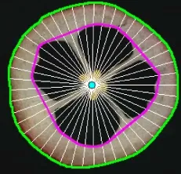
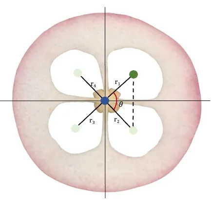
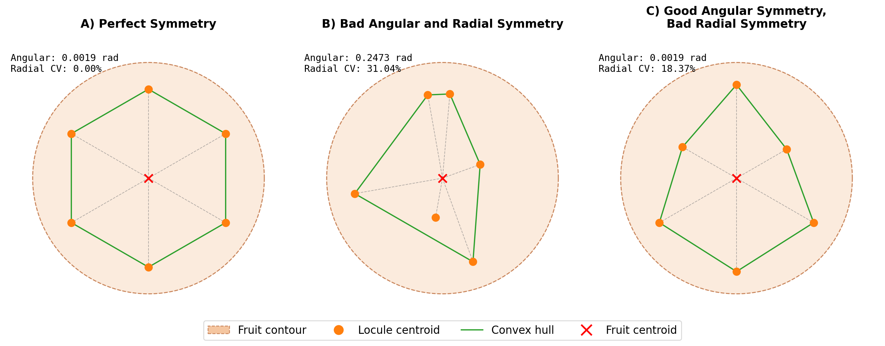
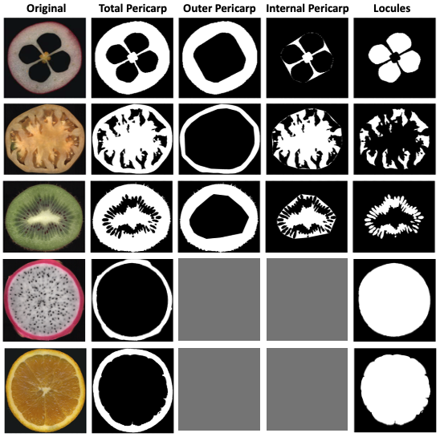
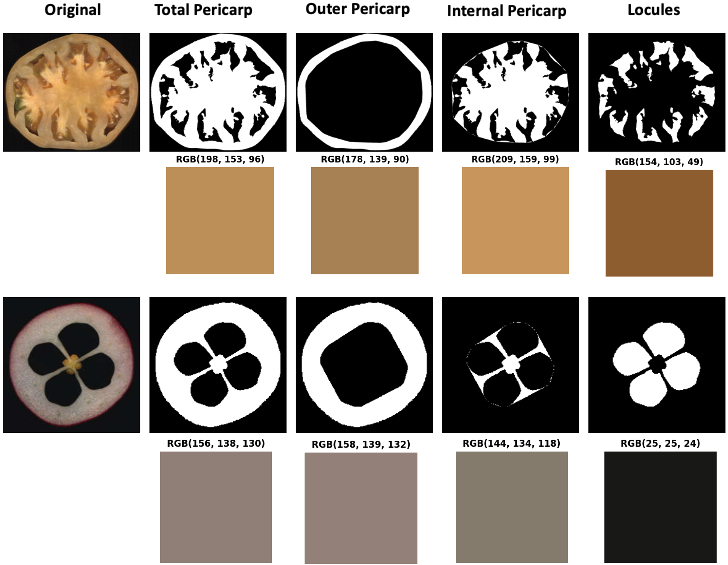
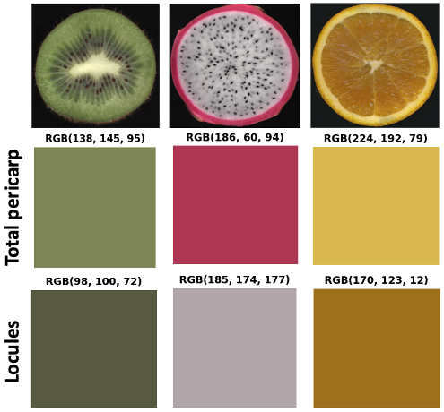

# Measurements

This section lists all traits returned by `FruitInternalAnalyzer` and `FruitExternalAnalyzer`. Results are stored in two separate DataFrames: one for **morphology** and one for **color**.

---

## Morphology traits

Returned by `analyze_morphology()` and stored in `results.morphology_results`.

Column names that include a unit suffix (e.g. `fruit_area_cm2`) will reflect the unit used:

- `cm` or `cm2` when a size reference is detected or provided
- `px` or `px2` when no calibration is available

!!! info "Tissue regions"
    For visual examples of the tissue regions referenced in this section, see [Tissue regions and color extraction](#tissue-regions-and-color-extraction).

### Image metadata

| Column | Description | Internal | External |
|--------|-------------|:--------:|:--------:|
| `image_name` | Image filename | :fontawesome-solid-check:{ .icon-green } | :fontawesome-solid-check:{ .icon-green } |
| `label` | Label text detected via QR or OCR | :fontawesome-solid-check:{ .icon-green } | :fontawesome-solid-check:{ .icon-green } |
| `fruit_id` | Sequential fruit ID within the image | :fontawesome-solid-check:{ .icon-green } | :fontawesome-solid-check:{ .icon-green } |
| `n_locules` | Number of locules detected in the fruit | :fontawesome-solid-check:{ .icon-green } | :fontawesome-solid-minus:{ .icon-red } |
| `unit` | Measurement unit used: `cm` or `px` | :fontawesome-solid-check:{ .icon-green } | :fontawesome-solid-check:{ .icon-green } |

### Fruit morphology

| Column | Description | Internal | External |
|--------|-------------|:--------:|:--------:|
| `fruit_area_cm2` / `fruit_area_px2` | Total fruit contour area (a direct measure of fruit size) | :fontawesome-solid-check:{ .icon-green } | :fontawesome-solid-check:{ .icon-green } |
| `fruit_perimeter_cm` / `fruit_perimeter_px` | Fruit contour perimeter (longer perimeters indicate more irregular shapes) | :fontawesome-solid-check:{ .icon-green } | :fontawesome-solid-check:{ .icon-green } |
| `fruit_circularity` | `4π·area / perimeter²` -> [0, 1]. Measures how close the fruit is to a perfect circle; values near 1 indicate round fruits | :fontawesome-solid-check:{ .icon-green } | :fontawesome-solid-check:{ .icon-green } |
| `fruit_solidity` | `area / convex_hull_area` -> [0, 1]. Measures how well the fruit area fills its convex hull; low values indicate concave or irregular fruits | :fontawesome-solid-check:{ .icon-green } | :fontawesome-solid-check:{ .icon-green } |
| `fruit_convexity` | `convex_hull_perimeter / contour_perimeter` -> [0, 1]. Measures how smooth the fruit boundary is relative to its convex hull; low values indicate bumpy or lobed surfaces | :fontawesome-solid-check:{ .icon-green } | :fontawesome-solid-check:{ .icon-green } |
| `fruit_major_axis_cm` / `fruit_major_axis_px` | Longest straight-line distance between any two points on the fruit contour (useful for estimating fruit length) | :fontawesome-solid-check:{ .icon-green } | :fontawesome-solid-check:{ .icon-green } |
| `fruit_minor_axis_cm` / `fruit_minor_axis_px` | Maximum width of the fruit measured perpendicularly to the major axis (useful for estimating fruit width) | :fontawesome-solid-check:{ .icon-green } | :fontawesome-solid-check:{ .icon-green } |
| `fruit_box_length_cm` / `fruit_box_length_px` | Longest side of the bounding box (alternative estimate of fruit length) | :fontawesome-solid-check:{ .icon-green } | :fontawesome-solid-check:{ .icon-green } |
| `fruit_box_width_cm` / `fruit_box_width_px` | Shortest side of the bounding box (alternative estimate of fruit width) | :fontawesome-solid-check:{ .icon-green } | :fontawesome-solid-check:{ .icon-green } |
| `fruit_aspect_ratio` | `box_width / box_length` -> [0, 1]. Values near 1 indicate round fruits; lower values indicate elongated fruits | :fontawesome-solid-check:{ .icon-green } | :fontawesome-solid-check:{ .icon-green } |
| `fruit_compactness` | `fruit_area / bounding_box_area` -> [0, 1]. How efficiently the fruit fills its bounding box; higher values indicate more compact shapes | :fontawesome-solid-check:{ .icon-green } | :fontawesome-solid-check:{ .icon-green } |
| `fruit_lobedness_cm` / `fruit_lobedness_px` | Standard deviation of radial distances from the fruit centroid to the outer fruit contour. A proxy for surface irregularity: higher values indicate a more lobed or uneven surface | :fontawesome-solid-check:{ .icon-green } | :fontawesome-solid-check:{ .icon-green } |

### Pericarp

| Column | Description | Internal | External |
|--------|-------------|:--------:|:--------:|
| `total_outer_pericarp_area_cm2` / `total_outer_pericarp_area_px2` | Total area of the outer pericarp region (`total fruit area` – `internal fruit area`) | :fontawesome-solid-check:{ .icon-green } | :fontawesome-solid-minus:{ .icon-red } |
| `outer_pericarp_mean_thickness_cm` / `outer_pericarp_mean_thickness_px` | Mean pericarp wall thickness, estimated as the distance from the outer fruit contour to the internal cavity boundary along radial rays cast from the fruit centroid | :fontawesome-solid-check:{ .icon-green } | :fontawesome-solid-minus:{ .icon-red } |
| `outer_pericarp_std_thickness_cm` / `outer_pericarp_std_thickness_px` | Standard deviation of pericarp thickness across all rays (indicates how uniform the wall is) | :fontawesome-solid-check:{ .icon-green } | :fontawesome-solid-minus:{ .icon-red } |
| `outer_pericarp_cv_thickness` | Coefficient of variation of pericarp thickness (%) (allows comparing wall uniformity across fruits regardless of their size) | :fontawesome-solid-check:{ .icon-green } | :fontawesome-solid-minus:{ .icon-red } |

### Internal areas

| Column | Description | Internal | External |
|--------|-------------|:--------:|:--------:|
| `total_internal_fruit_area_cm2` / `total_internal_fruit_area_px2` | Total internal fruit area (`internal pericarp` + `locules`) | :fontawesome-solid-check:{ .icon-green } | :fontawesome-solid-minus:{ .icon-red } |
| `total_internal_pericarp_area_cm2` / `total_internal_pericarp_area_px2` | Area of the internal pericarp tissue (`internal fruit area` – `locule area`) (reflects the size of the tissue surrounding the locules) | :fontawesome-solid-check:{ .icon-green } | :fontawesome-solid-minus:{ .icon-red } |
| `total_locules_area_cm2` / `total_locules_area_px2` | Total area of all detected locules | :fontawesome-solid-check:{ .icon-green } | :fontawesome-solid-minus:{ .icon-red } |

### Locules

| Column | Description | Internal | External |
|--------|-------------|:--------:|:--------:|
| `locules_mean_area_cm2` / `locules_mean_area_px2` | Mean area per individual locule | :fontawesome-solid-check:{ .icon-green } | :fontawesome-solid-minus:{ .icon-red } |
| `locules_std_area_cm2` / `locules_std_area_px2` | Standard deviation of locule areas (indicates size variability among locules) | :fontawesome-solid-check:{ .icon-green } | :fontawesome-solid-minus:{ .icon-red } |
| `locules_cv_area` | Coefficient of variation of locule areas (%) (allows comparing size homogeneity across fruits of different sizes) | :fontawesome-solid-check:{ .icon-green } | :fontawesome-solid-minus:{ .icon-red } |
| `locules_mean_circularity` | Mean circularity across all locules (indicates the overall roundness of the locule compartments) | :fontawesome-solid-check:{ .icon-green } | :fontawesome-solid-minus:{ .icon-red } |
| `locules_std_circularity` | Standard deviation of locule circularities | :fontawesome-solid-check:{ .icon-green } | :fontawesome-solid-minus:{ .icon-red } |
| `locules_cv_circularity` | Coefficient of variation of locule circularities (%) | :fontawesome-solid-check:{ .icon-green } | :fontawesome-solid-minus:{ .icon-red } |
| `locules_angular_symmetry` | Mean angular error between observed locule positions and an ideal equally-spaced arrangement (lower values indicate more symmetric angular distribution) | :fontawesome-solid-check:{ .icon-green } | :fontawesome-solid-minus:{ .icon-red } |
| `locules_radial_symmetry` | Coefficient of variation of locule radial distances from the fruit centroid (%) (lower values indicate more uniform radial spacing) | :fontawesome-solid-check:{ .icon-green } | :fontawesome-solid-minus:{ .icon-red } |

### Ratios

All tissue area ratios are unitless, allowing comparison across fruits of different sizes.

| Column | Numerator | Denominator | Internal | External |
|--------|-----------|-------------|:--------:|:--------:|
| `outer_pericarp_to_fruit_ratio` | Outer pericarp area | Total fruit area | :fontawesome-solid-check:{ .icon-green } | :fontawesome-solid-minus:{ .icon-red } |
| `internal_pericarp_to_fruit_ratio` | Internal pericarp area | Total fruit area | :fontawesome-solid-check:{ .icon-green } | :fontawesome-solid-minus:{ .icon-red } |
| `locules_to_fruit_ratio` | Total locule area | Total fruit area | :fontawesome-solid-check:{ .icon-green } | :fontawesome-solid-minus:{ .icon-red } |
| `locules_to_total_internal_ratio` | Total locule area | Total internal fruit area | :fontawesome-solid-check:{ .icon-green } | :fontawesome-solid-minus:{ .icon-red } |
| `internal_pericarp_to_total_internal_ratio` | Internal pericarp area | Total internal fruit area | :fontawesome-solid-check:{ .icon-green } | :fontawesome-solid-minus:{ .icon-red } |

---

## Color traits

Returned by `analyze_color()` and stored in `results.color_results`.

By default, Traitly extracts the **mean** (or optionally the **median**) of each color channel across all pixels in the region of interest. The standard deviation and coefficient of variation are also reported for each channel.

If `get_color_histogram=True`, Traitly returns a pixel count per intensity bin for each channel, where each bin corresponds to one intensity value. For example, `R_128` contains the number of pixels with a red value of 128. Setting `normalize=True` divides each count by the total number of valid pixels, returning proportions instead of raw counts.

### Tissue options

Color can be extracted independently for different fruit regions. In `FruitExternalAnalyzer`, since fruits do not have internal cavities, only `total_pericarp` is available by default and the `tissue` column is not included in the results.

| Tissue | Description | Internal | External |
|--------|-------------|:--------:|:--------:|
| `total_pericarp` | Full fruit area, excluding locules | :fontawesome-solid-check:{ .icon-green } | :fontawesome-solid-check:{ .icon-green } |
| `outer_pericarp` | Outer pericarp wall (total fruit area minus internal region) | :fontawesome-solid-check:{ .icon-green } | :fontawesome-solid-minus:{ .icon-red } |
| `internal_pericarp` | Internal pericarp tissue between the outer wall and the locules | :fontawesome-solid-check:{ .icon-green } | :fontawesome-solid-minus:{ .icon-red } |
| `locules` | Locule regions only | :fontawesome-solid-check:{ .icon-green } | :fontawesome-solid-minus:{ .icon-red } |

### Table structure

For `FruitInternalAnalyzer`, each row represents one tissue of one fruit:

| `image_name` | `label` | `fruit_id` | `tissue` | `R_mean` | `G_mean` | … |
---------------|---------|------------|----------|----------|----------|---|
| img_01.jpg | TOM-001 | 1 | total_pericarp | 185.3 | 52.1 | … |
| img_01.jpg | TOM-001 | 1 | outer_pericarp | 190.7 | 48.6 | … |

For `FruitExternalAnalyzer`, the `tissue` column is omitted, so there will be only one row per fruit:

| `image_name` | `label` | `fruit_id` | `R_mean` | `G_mean` | … |
|--------------|---------|------------|----------|----------|---|
| img_01.jpg | TOM-001 | 1 | 185.3 | 52.1 | … |
| img_01.jpg | TOM-001 | 2 | 190.7 | 48.6 | … |

### Color channels

| Column | Color space | Range | Description |
|--------|------------|-------|-------------|
| `R_mean` / `R_median` | RGB | 0–255 | Red channel |
| `R_std` | RGB | ≥ 0 | Standard deviation of the red channel |
| `G_mean` / `G_median` | RGB | 0–255 | Green channel |
| `G_std` | RGB | ≥ 0 | Standard deviation of the green channel |
| `B_mean` / `B_median` | RGB | 0–255 | Blue channel |
| `B_std` | RGB | ≥ 0 | Standard deviation of the blue channel |
| `L_mean` / `L_median` | L\*a\*b\* | 0–100 | Lightness (perceptually uniform, independent of hue) |
| `L_std` | L\*a\*b\* | ≥ 0 | Standard deviation of lightness |
| `a_mean` / `a_median` | L\*a\*b\* | –128 to +127 | Green–red axis (positive values indicate red tones, negative indicate green) |
| `a_std` | L\*a\*b\* | ≥ 0 | Standard deviation of the green–red axis |
| `b_mean` / `b_median` | L\*a\*b\* | –128 to +127 | Blue–yellow axis (positive values indicate yellow, negative indicate blue) |
| `b_std` | L\*a\*b\* | ≥ 0 | Standard deviation of the blue–yellow axis |
| `H_mean` / `H_median` | HSV | 0–360° | Hue (circular mean) (represents the dominant color; e.g., ~0/360°=red, ~120°=green, ~240°=blue) |
| `H_std` | HSV | ≥ 0° | Circular standard deviation of hue (indicates how variable the hue is within the region) |
| `S_mean` / `S_median` | HSV | 0–100 | Saturation — how vivid or pure the color is |
| `S_std` | HSV | ≥ 0 | Standard deviation of saturation |
| `V_mean` / `V_median` | HSV | 0–100 | Value (brightness) |
| `V_std` | HSV | ≥ 0 | Standard deviation of value |
| `Gray_mean` / `Gray_median` | Grayscale | 0–255 | Mean pixel intensity (a simple luminance measure) |
| `Gray_std` | Grayscale | ≥ 0 | Standard deviation of pixel intensity |

!!! tip "Why use circular statistics for hue?"
    Hue is a circular variable, where 0° and 360° represent the same color (red). Using standard mean and standard deviation on hue values near 0°/360° would produce incorrect results (e.g., a "mean" near 180°). Traitly uses circular statistics to correctly handle this periodicity.

---

## Notes

### Why include CV alongside mean and standard deviation?

Standard deviation (SD) is calculated relative to the mean of each fruit. This means the same SD value has a different practical significance depending on the scale of the measurement. For example, an SD of 5 px in a fruit with a mean pericarp thickness of 100 px represents much less variation than the same SD in a fruit with a mean of 20 px. The **coefficient of variation** (`CV = SD / mean × 100`) accounts for this by expressing variability as a percentage of the mean, making it possible to compare homogeneity across fruits of different sizes.

### Pericarp thickness and lobedness

Both `outer_pericarp_mean_thickness` and `fruit_lobedness` are estimated using radial rays cast from the fruit centroid toward the fruit contour. The image below shows this approach on a real fruit cross-section.

<figure style="text-align: center; margin: 0 auto;">
  
  <figcaption><em>Radial rays cast from the fruit centroid (cyan dot) to the outer fruit contour (green) and the internal region boundary (magenta).</em></figcaption>
</figure>

- **`outer_pericarp_mean_thickness`**: mean of all ray segment lengths between the outer fruit contour and the internal contour. The standard deviation and CV of those lengths describe how uniform the wall is around the fruit.
- **`fruit_lobedness`**: standard deviation of the full ray lengths from the fruit centroid to the outer contour. A perfectly round fruit has nearly identical ray lengths in all directions, giving a low SD. A lobed or irregular fruit shows more variation, giving a higher value.

### Symmetry interpretation

For `locules_angular_symmetry` and `locules_radial_symmetry`, **lower values indicate greater symmetry**. Both metrics are only meaningful when `n_locules ≥ 2`.

Each locule is described by two polar coordinates relative to the fruit centroid: its **angular position (θ)** and its **radial distance (r)**.

<figure style="text-align: center; margin: 0 auto;">
  
  <figcaption><em>Locule centroids (green circles) described by their angles θ and radial distances r from the fruit centroid (blue circle).</em></figcaption>
</figure>

- **`locules_angular_symmetry`**: measures how evenly the locules are distributed around the fruit center. For a fruit with *n* locules, perfect angular symmetry would place them exactly 360°/n apart. It is the mean absolute deviation between the observed angles and that ideal arrangement. A value near 0 means evenly spaced locules; higher values indicate an uneven angular distribution.

- **`locules_radial_symmetry`**: measures how similar the radial distances are across locules. It is the coefficient of variation (%) of all *r* values. A value near 0 means all locules are at roughly the same distance from the center; higher values indicate that some locules are closer to the center than others.

<figure style="text-align: center; margin: 0 auto;">
  
  <figcaption><em>Examples of angular and radial symmetry results.</em></figcaption>
</figure>

### Tissue regions and color extraction { #tissue-regions-and-color-extraction }

The images below illustrate how Traitly segments each tissue region and what color information is extracted from each one.

The binary masks show exactly which pixels are included per tissue. Gray panels indicate tissues that were not selected for the color analysis. These masks correspond to the regions segmented in both `analyze_morphology()` and `analyze_color()`: `total_pericarp`, `outer_pericarp`, `internal_pericarp`, and `locules`.

In `analyze_morphology()`, `total_internal_fruit` refers to the combined area of `internal_pericarp` + `locules`, and `total_fruit_area` refers to `total_pericarp` + `locules`.

<figure style="text-align: center; margin: 0 auto;">
  
  <figcaption><em>Binary masks for each tissue region across different fruit species.</em></figcaption>
</figure>

`analyze_color()` can extract color statistics independently for each of these regions, as shown below. Note that cranberry locules appear nearly black since they are empty cavities, so the extracted color reflects the dark background rather than fruit tissue.

<figure style="text-align: center; margin: 0 auto;">
  
  <figcaption><em>Mean RGB color extracted from each tissue region for tomato and cranberry.</em></figcaption>
</figure>

Different fruit species have very different internal structures, so not all regions extracted by Traitly are always relevant. In those cases, `analyze_color()` lets you select only the regions that make sense for your fruits, as shown below.

<figure style="text-align: center; margin: 0 auto;">
  
  <figcaption><em>Color extraction for total pericarp and locule areas across species.</em></figcaption>
</figure>

