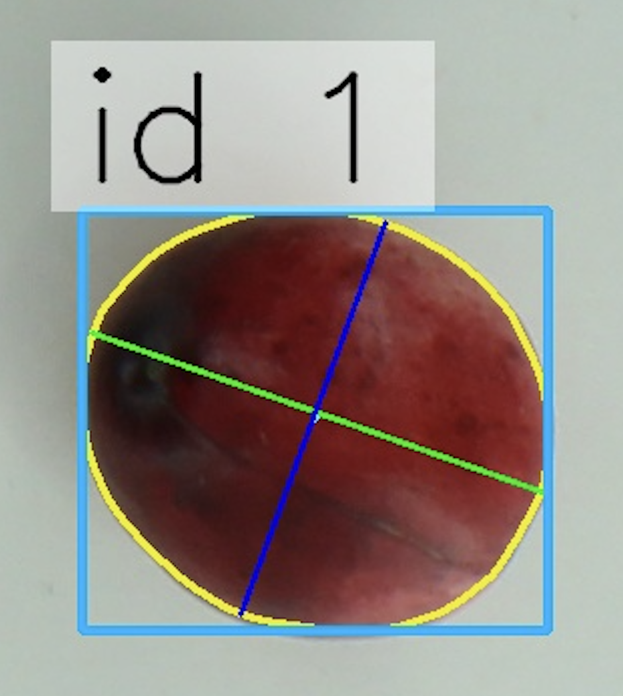
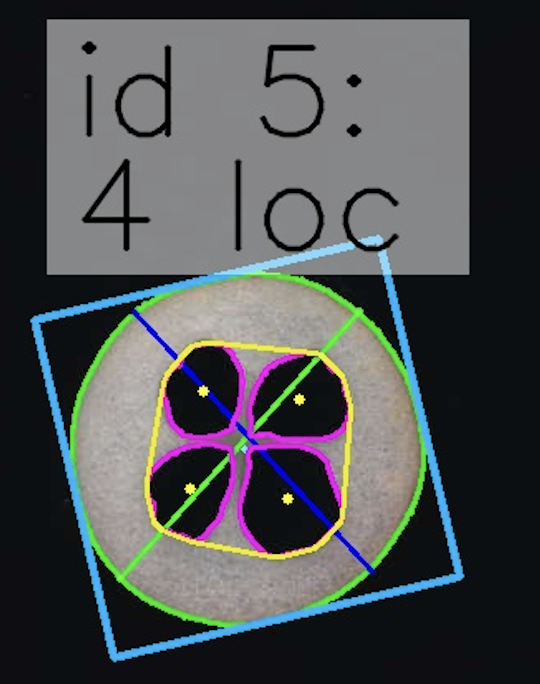
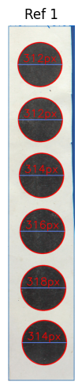
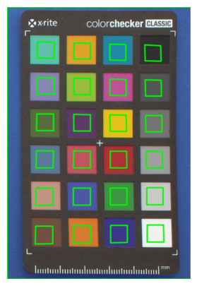

<div class="animate" markdown>

# Results ⊹ ࣪ ˖

Every analysis in Traitly produces up to four types of output: two results tables (morphology and color), annotated images, and a session report. This section describes each one.

---

## Results tables

Traitly returns measurements as [pandas DataFrames](https://pandas.pydata.org/docs/reference/api/pandas.DataFrame.html), accessible through the `results` object after running `analyze_morphology()` and/or `analyze_color()`:

```python
analyzer.results.morphology_results  # morphology DataFrame
analyzer.results.color_results       # color DataFrame
```

When using `analyze_folder()` for batch processing, both tables are automatically saved as CSV files in the output folder. `analyze_folder()` also saves a **`session_report.txt`** alongside the CSVs. It includes the Traitly version and its dependencies, the date and time of the analysis, the input folder, and all parameters passed to each step of the pipeline. If any images failed to process, an **`error_report.txt`** is also saved listing each failed file and the reason for failure:

```
Results/
├── morphology_results.csv
├── color_results.csv
├── session_report.txt
└── error_report.txt      <- only if errors occurred
```

Running Traitly from the CLI produces the same output structure as `analyze_folder()`.

!!! example ""
    A full description of all available columns is available in the [Measurements](measurements.md) section.

---

## Annotated images

### Fruits annotation

For every processed image, Traitly saves an annotated version that overlays the detected contours and fruit IDs directly on the original image. These are useful for visually verifying that detection and segmentation worked correctly before drawing conclusions from the data.

```
Results/
└── image_name_annotated.jpg
```

<div style="display: flex; gap: 16px; justify-content: center; align-items: flex-start;">
  <figure style="text-align: center; margin: 0;">
    
    <figcaption><em>External analysis — fruit contour, axes, bounding box, and fruit ID label.</em></figcaption>
  </figure>
  <figure style="text-align: center; margin: 0;">
    
    <figcaption><em>Internal analysis — fruit and locule contours, internal cavity boundary, axes, bounding box, centroids, and fruit ID with locule count label.</em></figcaption>
  </figure>
</div>

The annotations vary depending on the analyzer and the steps run:

`FruitExternalAnalyzer`:

- Fruit ID label (`id 1`)
- Fruit contour in **yellow**
- Major axis in **green**, minor axis in **blue**
- Bounding box in **light blue**

`FruitInternalAnalyzer`:

- Fruit ID and locule count label (`id 5: 4 loc`)
- Fruit outer contour in **green**
- Internal fruit region boundary in **yellow**
- Locule contours in **magenta**
- Major axis in **green**, minor axis in **blue**
- Bounding box in **light blue**
- Fruit centroid as a **cyan** dot
- Locule centroids as **yellow** dots

!!! note "Color-only analysis"
    If `analyze_morphology()` is not called and only `analyze_color()` is run with `FruitInternalAnalyzer`, the annotated image will show a simplified version: fruit contour, locule contours, internal cavity boundary, and fruit ID labels – without axes, bounding box, or centroids.

### Size reference overlay
If a circular size reference is included in the image, the annotation also shows the detection result: a light blue bounding box around the detected reference strip labeled with its YOLO confidence score, each circle outlined in red, and its measured diameter in pixels marked with a blue line. This makes it easy to verify that the reference was detected correctly before trusting the calibrated measurements.

<figure style="text-align: center; margin: 0 auto;">
  
  <figcaption><em>Size reference box and circles detected</em></figcaption>
</figure>

### Color checker overlay
If a Macbeth color checker card is detected, the annotation draws a green rectangle over each color patch, marking the exact area used for color extraction from that patch.

<figure style="text-align: center; margin: 0 auto;">
  
  <figcaption><em>Color checker card and its color patches detected</em></figcaption>
</figure>

---

## Session report

At any point after running the analysis, you can save the parameters used in the current session by calling `save_parameters()`:

```python
analyzer.save_parameters(output_path="Results/")
```

This saves two files:

```
Results/
├── image_name_parameters.txt
└── image_name_parameters.json
```

The **`.txt`** file records every parameter passed to each step of the pipeline — masking, detection, morphology, color — along with the versions of all dependencies. Useful for sharing, reporting, or documenting your analysis.

The **`.json`** file contains the same information in a format designed to be used directly by Traitly. You can pass it to `analyze_folder()` or the CLI to apply the exact same parameters to a new set of images:

```python
# Python
analyzer.analyze_folder(
    "path/to/folder",
    json_path="Results/image_name_parameters.json"
)
```

```bash
# CLI
traitly --fruit_internal -i images/ --json parameters.json
traitly --fruit_external -i images/ --json parameters.json
```

</div>

