# Definiendo umbrales de color para la segmentación del fondo

*Versión de Traitly utilizada en este tutorial: 0.1.0*

En este tutorial veremos cómo ajustar los umbrales de color para segmentar el fondo de las imágenes con `FruitExternalAnalyzer`.

!!! tip ""
    :fontawesome-solid-file-code: :fontawesome-solid-download: Descarga el **Jupyter notebook** y todas las imágenes de este tutorial [aquí](https://github.com/mariameraz/traitly/tree/main/tutorials_data/background_segmentation).

Por defecto, `FruitExternalAnalyzer.generate_fruit_mask()` asume un fondo azul. Además, tiene umbrales preconfigurados para fondos blancos (`'white'`) y negros (`'black'`). Sin embargo, también es posible definir umbrales personalizados de forma manual. Para más detalles, ver la sección [External Analyzer Class](../workflow/external_class.md#generate_fruit_mask).

!!! note "Segmentación de fondo en el análisis interno de frutos"
    Aunque `FruitInternalAnalyzer` espera un fondo negro, la segmentación con fondos de otro color funciona exactamente de la misma manera que se muestra aquí.

---

## Fondo azul

Primero, cargamos la clase `FruitExternalAnalyzer` de la librería `traitly` y la imagen que queremos analizar. Como la imagen incluye una tira de referencia de tamaño, corremos `setup_measurements()` para detectar su posición y excluir esa zona de las máscaras de frutos (ver sección [External Analyzer Class](../workflow/external_class.md#setup_measurements) para más detalles sobre cómo funciona `setup_measurements()`).
```python
from traitly.fruit_phenotyping import FruitExternalAnalyzer


path = './Test_10.png'
blue_example = FruitExternalAnalyzer(path)
blue_example.load_image()
blue_example.setup_measurements(verbose = False)
```
 
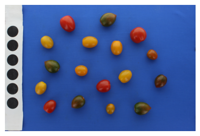
    
Como el **azul** es el color por defecto, no es necesario pasar ningún argumento adicional a `generate_fruit_mask()` para esta imagen.
```python
blue_example.generate_fruit_mask()
```

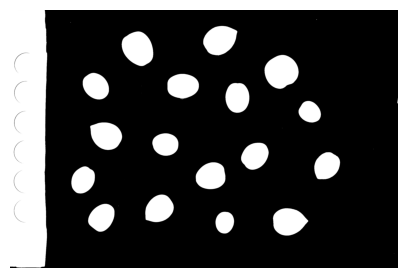
    
Podemos verificar el número de contornos detectados y su ubicación con `plot=True` en `detect_fruits()`.
```python
blue_example.detect_fruits(plot = True, contour_thickness = 8)
```
    
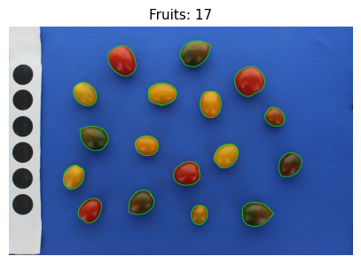
    
    =====================================
    . ݁₊ ⊹ . ݁ ⟡ ݁ Detected fruits: 17 ⟡ ݁ . ⊹ ₊ ݁.
    
     > Parameters used:
            - min_fruit_circularity: 0.5
            - min_fruit_area: 500
    =====================================

---

## Fondo gris

En este segundo ejemplo tenemos una imagen con fondo gris. Como el gris no es un color preconfigurado, definiremos **umbrales HSV personalizados** de forma manual. Para esto, podemos usar `generate_color_scatterplot()`, que muestra los colores de los píxeles de la imagen (10,000 por defecto) en el espacio HSV (ver sección [External Analyzer Class](../workflow/external_class.md#generate_color_scatterplot) para más detalles sobre cómo funciona esta función). Cada punto en los gráficos representa un píxel, coloreado con su valor **RGB** real. El objetivo es encontrar el rango [H,S,V] en el que caen los píxeles del fondo gris.
```python
path = './Test_27.png'
gray_example = FruitExternalAnalyzer(path)
gray_example.load_image()
gray_example.setup_measurements(verbose = False)
```
    
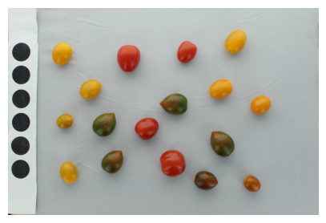
```python
gray_example.generate_color_scatterplot()
```
    
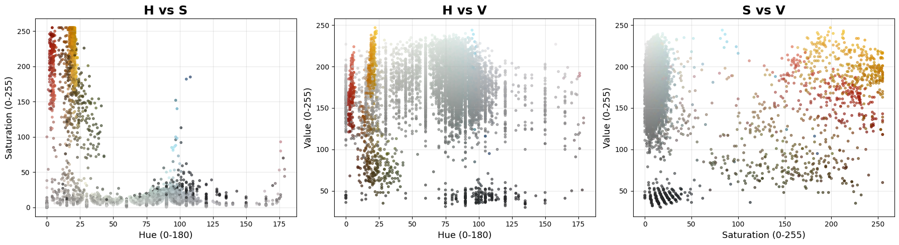

En este caso, los gráficos **H vs S** y **S vs V** son los más informativos:

- En **H vs S**, se puede ver que los píxeles grises se distribuyen en todo el rango de matiz (H) de 0 a 180 (círculo naranja), y que la mayoría tiene un valor de saturación (S) menor a 50 (línea azul punteada).
- El gráfico **S vs V** confirma que los píxeles del fondo se agrupan en un rango de brillo (V) de 60 a 255 (línea morada punteada) y una saturación (S) de 0 a 50 (línea azul punteada).

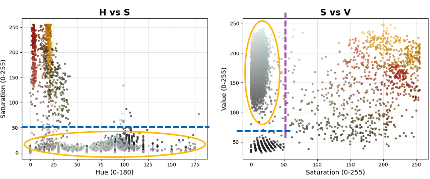

A partir de esto, definimos `lower_color` y `upper_color`, donde cada valor sigue el formato `[H,S,V]`, y los pasamos directamente a `generate_fruit_mask()`.
```python
lower_color = [0, 0, 60]
upper_color = [180, 50, 255]

gray_example.generate_fruit_mask(lower_hsv = lower_color, 
                                 upper_hsv = upper_color)
``` 
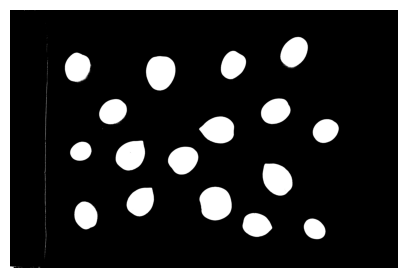
    

Verificamos con `detect_fruits()` que los frutos quedaron correctamente segmentados. En este caso, como algunos frutos eran menos circulares que los del ejemplo anterior, redujimos ligeramente el umbral de circularidad de 0.5 (valor por defecto) a 0.3.
```python
gray_example.detect_fruits(plot = True, 
                           contour_thickness = 8, 
                           min_fruit_circularity = 0.3)
```

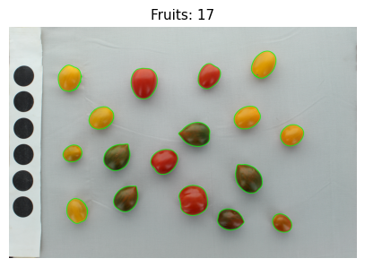
    
    =====================================
    . ݁₊ ⊹ . ݁ ⟡ ݁ Detected fruits: 17 ⟡ ݁ . ⊹ ₊ ݁.
    
     > Parameters used:
            - min_fruit_circularity: 0.3
            - min_fruit_area: 500
    =====================================

---

## Fondo blanco

Por último, tenemos un ejemplo con fondo blanco. Como `white` es un color preconfigurado, simplemente usamos `background_color='white'` en `generate_fruit_mask()`.
```python
path = './Test_56.png'
white_example = FruitExternalAnalyzer(path)
white_example.load_image()
white_example.setup_measurements(verbose = False)
```
   
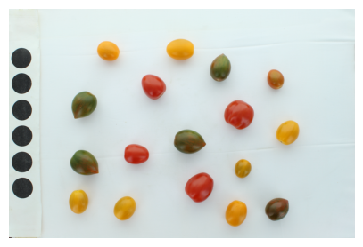
```python
white_example.generate_fruit_mask(background_color = 'white')
```
    
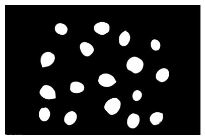
```python
white_example.detect_fruits(plot = True, 
                            contour_thickness = 8, 
                            contour_color = (0,0,220), 
                            min_fruit_circularity = 0.3)
```

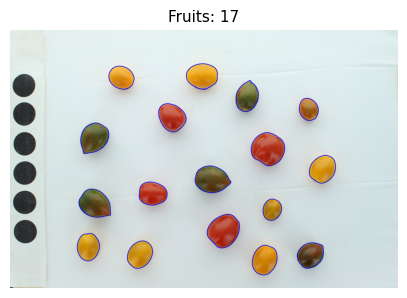
    
    =====================================
    . ݁₊ ⊹ . ݁ ⟡ ݁ Detected fruits: 17 ⟡ ݁ . ⊹ ₊ ݁.
    
     > Parameters used:
            - min_fruit_circularity: 0.3
            - min_fruit_area: 500
    =====================================