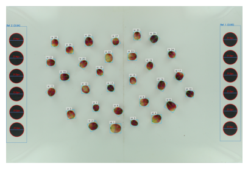
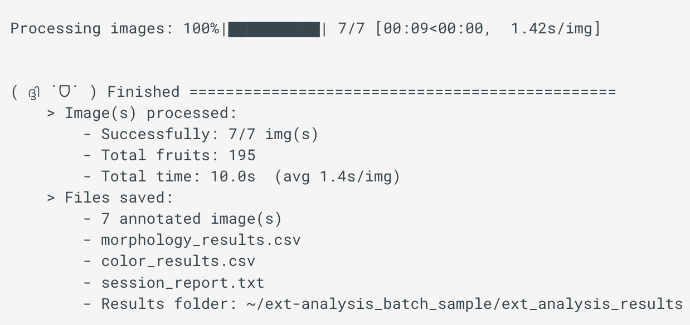

# Tutoriales ⊹ ࣪ ˖

Aquí encontrarás tutoriales paso a paso sobre los principales flujos de trabajo de Traitly, desde cargar tu primera imagen hasta extraer rasgos de morfología, color y simetría.

---

## 1. Inicio rápido

#### **•󠁏 Análisis completo en minutos**

---

Demostración sencilla de cómo realizar análisis de apariencia externa y estructura interna con imágenes de arándano rojo.

<figure markdown>
{ style="width:20%;"}
</figure>

[:octicons-arrow-right-24: Ir al tutorial](batch_tutorial_en.md)

---

## 2. Análisis interno

#### **•󠁏 Segmentación de lóculos**

---

Análisis de frutos con segmentación de lóculos compleja.

<figure markdown>
{ style="width:65%;"}
</figure>

[:octicons-arrow-right-24: Ir al tutorial](segmentate_locules.md)

---

## 3. Análisis externo

#### **•󠁏 Análisis de una imagen paso a paso**

---

Demostración completa del uso de `FruitExternalAnalyzer`: carga imágemes, genera máscaras binarias, detecta frutos y exporta resultados de morfología y color.

<figure markdown>
{ width=300}
</figure>

[:octicons-arrow-right-24: Ir al tutorial](individual_img_tutorial_en.md)

#### **•󠁏 Segmentación del fondo**

---

Define umbrales HSV personalizados para segmentar frutos sobre cualquier color de fondo.

<figure markdown>
{ width=300}
</figure>

[:octicons-arrow-right-24: Ir al tutorial](background_segmentation.md)

---

## 4. Procesamiento por lotes

#### **•󠁏 Análisis de múltiples imágenes**

---

Analiza una carpeta completa de imágenes de forma automática.

<figure markdown>
{ width=300}
</figure>

[:octicons-arrow-right-24: Ir al tutorial](batch_tutorial_en.md)

