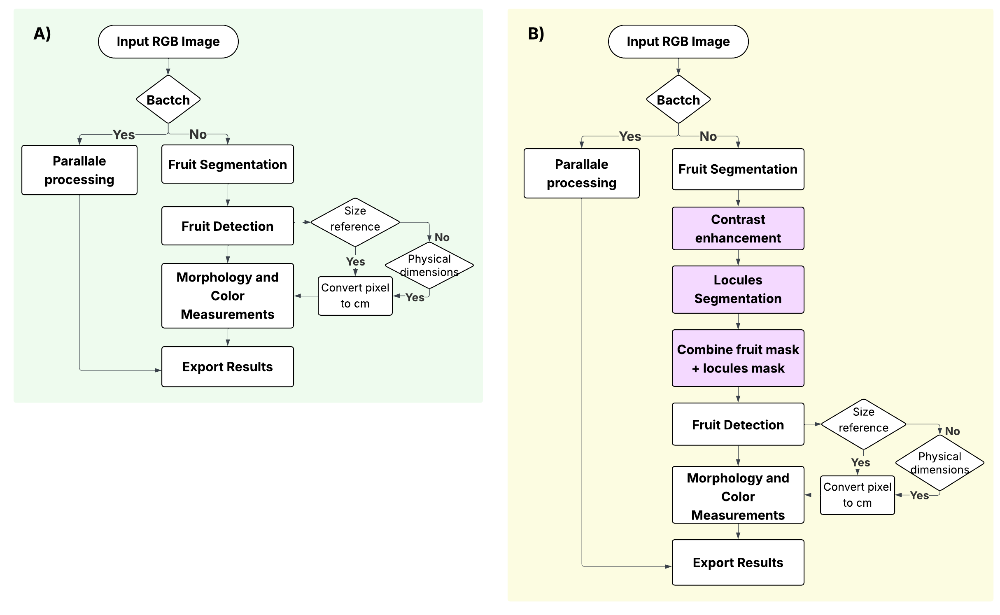

<div class="animate" markdown>

# Arquitectura de Traitly ⊹ ࣪ ˖

Traitly está construido sobre una estructura de clases de Python que separa claramente dos tipos de análisis fenotípicos: el análisis interno y el análisis externo de frutos. Esta organización te permite elegir el nivel de detalle que necesitas sin cargar con funcionalidades que no vas a utilizar.

El módulo principal `traitly.fruit_phenotyping` contiene dos clases principales:

```python
# Análisis de cortes transversales (con lóculos)
from traitly.fruit_phenotyping import FruitInternalAnalyzer

# Análisis de frutos enteros (solo contorno externo)
from traitly.fruit_phenotyping import FruitExternalAnalyzer
```

### ¿Qué hace cada clase?

| Clase | Enfoque | ¿Qué detecta? | Aplicación típica |
|--------|---------|---------------|-------------------|
| `FruitInternalAnalyzer` | **Morfología interna** | Contornos del fruto completo y de cada lóculo individual | Cortes transversales donde interesa cuantificar la organización interna (número de lóculos, área relativa, simetría, grosor del pericarpio, etcétera) y el color de sus diferentes tejidos (pericarpio y lóculos) |
| `FruitExternalAnalyzer` | **Morfología superficial** | Únicamente el contorno exterior del fruto | Frutos enteros para estudios de forma, tamaño y color externo |

Ambas clases comparten la misma lógica de pipeline – procesamiento de imagen, segmentación, extracción de contornos y cálculo de rasgos — pero están optimizadas para sus respectivos objetivos:

- **`FruitInternalAnalyzer`** busca relaciones jerárquicas: un contorno de fruto que contiene múltiples contornos de lóculos en su interior.
- **`FruitExternalAnalyzer`** se enfoca en la silueta completa del fruto, ignorando estructuras internas.


*Flujo general para cada análisis. **A)** `FruitExternalAnalyzer`: pipeline para el análisis de la apariencia externa de frutos enteros. **B)** `FruitInternalAnalyzer`: pipeline extendido para la detección y segmentación de frutos **y** lóculos para cortes transversales de los frutos.*

---

## ¿Cómo usar Traitly?

Traitly puede usarse en tres distintos ambientes:

**Desde Python (Jupyter Notebook o script)**: recomendado para explorar y ajustar parámetros de forma interactiva sobre imágenes individuales, y para el procesamiento eficiente de grandes lotes de imágenes.

**Desde la terminal (CLI)**: para ejecutar el análisis directamente desde la terminal sin necesidad de un script de Python, especialmente útil en servidores o entornos de cómputo sin interfaz gráfica. Consulta la sección [CLI](cli.md) para más detalles.

**Desde la aplicación Shiny**: para análisis interactivo sin necesidad de escribir código. Disponible localmente ejecutando `traitly-app` en la terminal (consulta la sección de [Shiny App](cli.md#shiny-app) para mas detalles), o en línea a través del [demo interactivo](https://huggingface.co/spaces/mariameraz/traitly).

!!! info ""
    Las siguientes secciones contienen la documentación detallada de cada entorno de uso, incluyendo ejemplos, parámetros configurables y rasgos extraídos. Consulta también las especificaciones de imágenes para [análisis interno](int_image_requirements.md) y [análisis externo](ext_image_requirements.md) para garantizar los mejores resultados.

</div>
