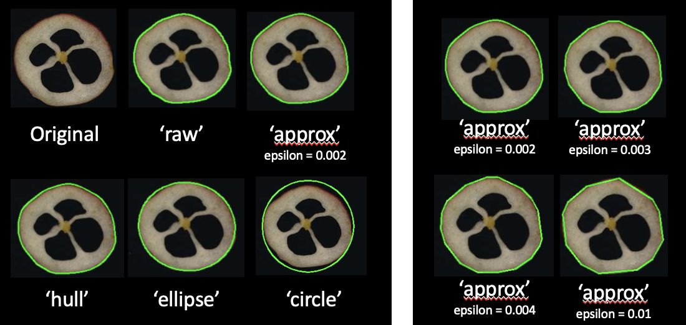
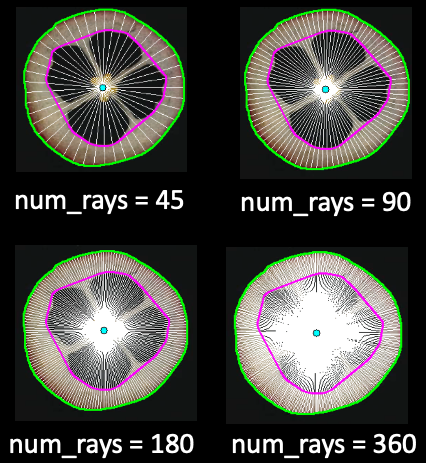
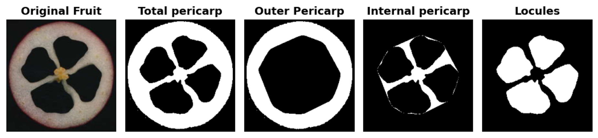

<div class="animate" markdown>

# Análisis interno: Clase y Métodos

En esta sección encontrarás todo lo que necesitas para usar `FruitInternalAnalyzer`, la clase principal para analizar imágenes de cortes transversales de frutos. Aquí se explica cada método, sus parámetros y cómo utilizarlos en tu flujo de trabajo.

---

## Clase `FruitInternalAnalyzer`

`FruitInternalAnalyzer` es la herramienta principal para analizar la morfología interna, color y simetría de frutos a partir de imágenes de cortes transversales. Puedes usarla para procesar una sola imagen o una carpeta completa con cientos de imágenes.

```python
from traitly.fruit_phenotyping import FruitInternalAnalyzer

# Para analizar una imagen
analizador = FruitInternalAnalyzer("ruta/de/mi/imagen.jpg")

# Para analizar varias imágenes en carpeta
analizador = FruitInternalAnalyzer("ruta/de/mi/carpeta/con/imagenes/")
```

| Parámetro | Tipo | Descripción |
|-----------|------|-------------|
| `image_path` | `str` | Ruta a la imagen o carpeta que quieres analizar |


!!! tip "Recomendación"
    Cuando tengas una carpeta con varias imágenes para analizar, te sugerimos:
    
    1. **Comienza con una imagen representativa** para ajustar los parámetros
    2. Experimenta con los métodos paso a paso hasta obtener buenos resultados
    3. Guarda la configuración ideal con `save_parameters()`
    4. Usa `analyze_folder(json_path="tu_archivo.json")` para procesar todo el lote automáticamente con los mismos parámetros
    
    Para ver ejemplos prácticos de este flujo de trabajo, consulta los [Tutoriales](tutorials/quickstart.md).


<br>

</div>

---

## Cómo se organiza el análisis

Cuando trabajas con `FruitInternalAnalyzer`, el análisis sigue este orden lógico:

```python
from traitly.fruit_phenotyping import FruitInternalAnalyzer

# Analizar una sola imágen
analyzer = FruitInternalAnalyzer('ruta/a/mi/imagen.jpg')

analyzer.load_image()                          # Cargar imagen
analyzer.setup_measurements()                  # Configurar calibración y etiquetas
analyzer.generate_fruit_mask()                 # Separar frutos del fondo
analyzer.enhance_locule_contrast()             # (Opcional) Mejorar contraste de lóculos
analyzer.generate_l_channel_histogram()        # (Opcional) Visualizar distribución del canal L para elegir umbral
analyzer.generate_locule_mask()                # (Opcional) Segmentar lóculos
analyzer.edit_mask()                           # (Opcional) Corregir manualmente la máscara activa
analyzer.detect_fruits()                       # Identificar frutos individuales
analyzer.analyze_morphology()                  # Obtener medidas morfológicas
analyzer.analyze_color()                       # (Opcional) Obtener medidas de color

## Guardar resultados
analyzer.results.save_all()               # Guardar todos los resultados (CSV e imágen anotada)     
analyzer.save_parameters()                # (Opcional) Guardar los parámetros usados en la sesión

```

Si trabajas con lotes de imágenes, no necesitas ejecutar estos pasos uno por uno, `analyze_folder()` lo hace todo automáticamente:

```python
# Analizar múltiples imágenes
analyzer = FruitInternalAnalyzer('ruta/a/mi/carpeta')              # Iniciar la clase con la ruta de tu carpeta
analyzer.analyze_folder(json_path = 'ruta/a/mi/parameters.json')   # Correr el análisis usando, opcionalmente, los parámetros guardados

```


<br>

---

## Lo que puedes obtener del analizador

Después de ejecutar los métodos, el analizador guarda los resultados en atributos que puedes consultar:

| Atributo | Qué contiene |
|----------|--------------|
| `img_path` | Ruta de la imagen que estás analizando |
| `img`, `img_rgb`, `img_hsv` | La imagen en diferentes formatos de color |
| `mask_fruit` | Máscara donde los frutos aparecen en blanco y el fondo en negro |
| `mask_locules` | Máscara donde los lóculos aparecen en negro y el resto del fruto en blanco (si corriste `generate_locule_mask()`) |
| `contours` | Lista de contornos de todos los frutos detectados |
| `fruit_locule_map` | Relación de qué lóculos pertenecen a cada fruto |
| `px_per_cm` | Factor de conversión de píxeles a centímetros (si calibraste) |
| `label_text` | Texto de la etiqueta detectada (si usaste detección) |
| `results` | Todos los resultados del análisis (tablas + imagen anotada) |
| `parameters` | Parámetros que usaste en esta sesión |

<br>

---

## Métodos:

!!! example ""
    Aquí explicamos cada método con ejemplos prácticos. Todos los parámetros tienen valores por defecto, así que puedes empezar con lo básico e ir ajustando según tus necesidades.


### `load_image`

Carga la imagen y prepara las representaciones internas (BGR, RGB, HSV).
Opcionalmente puede recortar una región de interés con `x`, `y`, `w`, `h`.

```python
analyzer.load_image(plot=True, plot_size=(5, 5))
analyzer.load_image(plot=True, show_axis=True, x=1500, y=0, w=2600, h=2700)
```

<br>

| Parámetro | Tipo | Default | Descripción |
|-----------|------|---------|-------------|
| `plot` | `bool` | `True` | Muestra la imagen cargada |
| `plot_size` | `tuple` | `(5, 5)` | Tamaño de la figura |
| `show_axis` | `bool` | `False` | Muestra los ejes en el plot |
| `x` | `int` | `None` | Coordenada izquierda del recorte |
| `y` | `int` | `None` | Coordenada superior del recorte |
| `w` | `int` | `None` | Ancho del recorte en píxeles |
| `h` | `int` | `None` | Alto del recorte en píxeles |

<br>

---


### `setup_measurements`

Realiza la detección de etiqueta y la referencia de tamaño y calcula el factor de escala píxel/cm.

??? note "Notas"

    - Cuando `detect_label=True`, la etiqueta se detecta en orden: primero QR y si no se encuentra, recurre a OCR. Para saltar la detección de QR e ir directo a OCR, activar `skip_qr=True`.

    - Cuando `fast_calibration=False` (default), la referencia de tamaño se detecta primero con YOLO y si falla, recurre a las medidas físicas de la imagen proporcionadas (`width_cm`, `length_cm`). Si no se encuentra referencia y `width_cm` y `length_cm` son `None`, los resultados se expresan en píxeles.
    
    - Para la detección de la referencia de tamaño, se asume que los círculos de la referencia son de color negro y que el fondo de la referencia es blanco.

    - Cuando se utiliza la referencia de tamaño para la calibración, el factor píxel/cm se calcula a partir del diámetro promedio de todos los círculos detectados. Por defecto, se descartan los círculos cuyo diámetro se desvía más de 2 desviaciones estándar respecto al promedio, con el fin de evitar sesgos en la estimación de la escala.


```python
# Usando medidas físicas y detectando etiqueta
analyzer.setup_measurements(
    width_cm=29.7,
    length_cm=21.0,
    detect_label=True
)

# Usando referencia de tamaño y detectando etiqueta solo con OCR
analyzer.setup_measurements(
    diameter_cm=1.7,
    detect_label=True,
    skip_qr=True
)
```

<br>

| Parámetro | Tipo | Default | Descripción |
|-----------|------|---------|-------------|
| `detect_label` | `bool` | `False` | Si `True`, activa detección de etiqueta (QR -> OCR) |
| `width_cm` | `float` | `None` | Ancho conocido de la imagen en cm |
| `length_cm` | `float` | `None` | Largo conocido de la imagen en cm |
| `diameter_cm` | `float` | `None` | Diámetro conocido del círculo de referencia en cm; si no se proporciona, usa 2.5 cm por defecto |
| `fast_calibration` | `bool` | `False` | Si `True`, omite YOLO y calibra usando `width_cm` y `length_cm`; si no se proporcionan, los resultados se expresan en píxeles |
| `confidence` | `float` | `0.6` | Confianza mínima para detección YOLO de la referencia |
| `skip_qr` | `bool` | `False` | Si `True`, omite detección de QR e intenta OCR directamente |
| `gpu` | `bool` | `False` | Si `True`, usa GPU para OCR; solo compatible con NVIDIA. Si falla, continua con CPU |
| `detect_color_checker` | `bool` | `False` | Si `True`, detecta carta de color (24 colores, estilo Macbeth) después de la calibración |
| `scale_factor` | `float` | `0.5` | Factor de reducción de imagen para detección de carta de color; debe estar entre 0.1 y 1.0, donde 1.0 utiliza el tamaño real de la imagen (0% de reducción) y 0.1 aplica una reducción del 90% |
| `language_label` | `list` | `["es", "en"]` | Idiomas para OCR |
| `font_size` | `int` | `3` | Tamaño de fuente para anotaciones sobre los circulos de la referencia |
| `plot_reference` | `bool` | `False` | Si `True`, muestra recorte de la referencia de tamaño detectada y anotada |
| `plot_color_checker` | `bool` | `False` | Si `True`, muestra recorte de la tarjeta de color detectada y anotada |
| `plot_size` | `tuple` | `(5, 5)` | Tamaño de figura para los plots |
| `verbose` | `bool` | `True` | Si `True`, imprime resultados en consola |


<br>

---

### `generate_color_scatterplot`

*Opcional*

Muestra un scatterplot de los colores de los píxeles de la **imagen completa** (frutos, fondo, referencias, etcétera) en el espacio HSV. Es útil para seleccionar umbrales adecuados antes de crear la máscara (parámetros `lower_hsv` y `upper_hsv` en `generate_fruit_mask()`).

```python
analyzer.generate_color_scatterplot(sample_size=10000)
```
<br>

| Parámetro | Tipo | Default | Descripción |
|-----------|------|---------|-------------|
| `sample_size` | `int` | `10000` | Número de píxeles a muestrear para el plot |
| `plot_size` | `tuple` | `(18, 5)` | Tamaño de la figura |


<br>

---

### `generate_fruit_mask`

Genera una máscara binaria segmentando el fondo de la imagen en el espacio HSV y detectando todo lo que no corresponde al fondo (frutos, referencia de tamaño, etiqueta, etcétera).

Por defecto, se asume un fondo negro, el cual es removido automáticamente. En la máscara resultante, el fondo se representa en negro (0) y los frutos en blanco (1). En frutos con lóculos vacíos (por ejemplo, chile o cranberry), las regiones internas correspondientes a los lóculos pueden aparecer como negro, ya que no contienen tejido del fruto.

Si se detectan regiones correspondientes a la referencia de tamaño o a la etiqueta en `setup_measurements()`, estas áreas se enmascaran en negro en la máscara final. No obstante, pueden permanecer contornos residuales, los cuales pueden ser descartados posteriormente durante los análisis de filtrado de contornos. Si dichas regiones no se detectan previamente, aparecerán como blanco en la máscara, al ser clasificadas como no-fondo.

```python
# Usando rangos de hsv personalizados
analyzer.generate_fruit_mask(
    lower_hsv=[20, 30, 30],
    upper_hsv=[80, 255, 255]
)

# Usando rangos predefinidos
analyzer.generate_fruit_mask(background_color = 'white')

```

<br>


| Parámetro | Tipo | Default | Descripción |
|-----------|------|---------|-------------|
| `lower_hsv` | `list[int]` | `None` | Umbral HSV inferior `[H, S, V]` para seleccionar el color del fondo; si `None`, se aplica umbralización automática |
| `upper_hsv` | `list[int]` | `None` | Umbral HSV superior `[H, S, V]` para seleccionar el color del fondo;  si `None`, se aplica umbralización automática |
| `background_color` | `str` | `None` | Opciones predefinidas: 'black' (por defecto), 'white', 'blue'. Se utiliza para definir umbrales predeterminados de HSV del fondo |
| `n_iteration` | `int` | `1` | Número de iteraciones para las operaciones morfológicas (solo aplica si `kernel_open` y/o `kernel_close` están definidos) |
| `kernel_blur` | `int` | `None` | Tamaño de kernel Gaussian blur |
| `kernel_open` | `int` | `None` | Tamaño de kernel apertura morfológica |
| `kernel_close` | `int` | `None` | Tamaño de kernel cierre morfológico |
| `canny_min` | `int` | `None` | Umbral mínimo Canny |
| `canny_max` | `int` | `None` | Umbral máximo Canny |
| `remove_roi` | `bool` | `True` | Si `True`, elimina regiones de etiqueta, referencia y carta de color de la máscara |
| `roi_expansion` | `int` | `10` | Margen en píxeles alrededor de las ROIs antes de eliminarlas |
| `fill_holes` | `bool` | `False` | Si `True`, rellena huecos cerrados en la máscara binaria |
| `apply_convex_hull` | `bool` | `False` | Si `True`, aplica convex hull solo a los contornos externos del fruto; no se aplica a lóculos u otras regiones internas |
| `erosion_px` | `int` | `0` | Radio en píxeles de la erosión elíptica en la mascara final |
| `stamp` | `bool` | `False` | Si `True`, invierte los colores de la imagen antes del enmascaramiento; asume un fondo origianl blanco |
| `plot` | `bool` | `True` | Muestra la máscara generada |
| `plot_size` | `tuple` | `(5, 5)` | Tamaño de la figura |


<br>

---

### `enhance_locule_contrast` 

*Opcional*

Aplica realce de contraste sobre el canal L (Lab) para aumentar la separación entre pericarpio (fruto) y lóculos, facilitando una segmentación por umbral en escala de grises en `generate_locule_mask()`.

Es especialmente útil cuando los lóculos no son huecos (por ejemplo, tomate o naranja) y por ello no aparecen de color negro (0) en la máscara binaria generada por `generate_fruit_mask()`.

??? note "Nota" 
    Una vez elegido un método con `compare_method=True`, es necesario ejecutar de nuevo la función con `contrast_method='...'` para continuar el pipeline con ese método.

```python
# Compara todos los métodos de contraste
analyzer.enhance_locule_contrast(compare_method=True)

# Aplicar contraste gamma
analyzer.enhance_locule_contrast(
    contrast_method='gamma',
    gamma=1.5,
    plot=True
)
```

<br>

| Parámetro         | Tipo              | Default   | Descripción                                                                                                    |
| ----------------- | ----------------- | --------- | -------------------------------------------------------------------------------------------------------------- |
| `contrast_method` | `str`             | `'gamma'` | Método de realce: `'gamma'`, `'sigmoid'`, `'exponential'` o `'none'` (sin transformación)                      |
| `gamma`           | `float`           | `1.5`     | Exponente gamma (solo si `contrast_method='gamma'`)                                                            |
| `gain`            | `float`           | `5`       | Ganancia de sigmoid (solo si `contrast_method='sigmoid'`)                                                      |
| `cutoff`          | `float`           | `0.5`     | Corte de sigmoid (solo si `contrast_method='sigmoid'`)                                                         |
| `c`               | `float`           | `0.5`     | Factor exponencial (solo si `contrast_method='exponential'`)                                                   |
| `kernel_blur`     | `int`             | `1`       | Tamaño del kernel de Gaussian blur aplicado antes del realce                                                 |
| `clip_limit`      | `int`     | `None`    | Aplica CLAHE después del método seleccionado                                                     |
| `tile_grid_size`  | `int`             | `12`      | Tamaño del grid de CLAHE (solo si `clip_limit` está definido)                                                  |
| `compare_method`  | `bool`            | `False`   | Si `True`, muestra una comparación lado a lado de los métodos disponibles |
| `plot`            | `bool`            | `True`    | Muestra el canal L realzado cuando `contrast_method=...` o la comparación entre métodos cuando `compare_method=True`       |
| `plot_size`       | `tuple[int, int]` | `(8, 10)` | Tamaño de la figura                                                                                            |

<br>

---

### `generate_locule_mask`

*Opcional*

Genera una máscara binaria de lóculos a partir de una umbralización en el canal L (Lab) previamente realzado, y la fusiona con la máscara de fruto generada por `generate_fruit_mask()`.

El método segmenta el tejido de los lóculos del resto del fruto mediante umbralización del canal L. Por defecto, utiliza el **método de Otsu** (`use_otsu=True`) para encontrar automáticamente el umbral óptimo — útil al procesar lotes con variaciones de iluminación. También es posible definir el umbral manualmente con `thresh_min`. Dentro del rango definido, las regiones más oscuras se interpretan como lóculos o tejidos internos, y las más claras como pericarpio.

En frutos donde ocurre lo contrario (por ejemplo, pitahaya), donde el pericarpio es más oscuro que el espacio locular, debe activarse `invert_locule=True`, lo cual invierte internamente la máscara de lóculos tras aplicar el umbral.

La fusión produce una máscara final en la que los frutos se representan en blanco (1) y los lóculos o tejidos internos en negro (0), manteniendo la coherencia con el esquema de segmentación del resto del pipeline.

??? note "Elegir el umbral"
    Antes de ejecutar este método, puedes visualizar la distribución de intensidades del canal L con `generate_l_channel_histogram()`. Este gráfico muestra cómo se distribuyen los píxeles dentro del fruto y dónde cae el umbral de Otsu, facilitando la decisión de usar `use_otsu=True` o un `thresh_min` manual, y si se necesita un `otsu_offset` para ajustar la separación.

```python
# Usando el umbral automático de Otsu (por defecto)
analyzer.generate_locule_mask(plot=True)

# Ajustando Otsu con un offset
analyzer.generate_locule_mask(use_otsu=True, otsu_offset=10, plot=True)

# Usando un umbral manual
analyzer.generate_locule_mask(use_otsu=False, thresh_min=107, plot=True)

# Lóculos más claros que el pericarpio
analyzer.generate_locule_mask(invert_locule=True, plot=True)
```

<br>


| Parámetro         | Tipo              | Default   | Descripción                                                                                          |
| ----------------- | ----------------- | --------- | ---------------------------------------------------------------------------------------------------- |
| `thresh_min`      | `int`             | `120`     | Umbral manual de binarización del canal L; solo se usa cuando `use_otsu=False`                       |
| `use_otsu`        | `bool`            | `True`    | Si `True`, calcula el umbral automáticamente con el método de Otsu, ignorando `thresh_min`           |
| `otsu_offset`     | `int`             | `0`       | Valor sumado al umbral de Otsu; valores positivos capturan más píxeles, negativos menos              |
| `kernel_close`    | `int`             | `None`    | Tamaño del kernel para cierre morfológico aplicado a la máscara de lóculos                           |
| `kernel_open`     | `int`             | `None`    | Tamaño del kernel para apertura morfológica aplicado a la máscara de lóculos                         |
| `kernel_blur`     | `int`             | `None`    | Tamaño del kernel para suavizado gaussiano aplicado tras las operaciones morfológicas                 |
| `erosion_px`      | `int`             | `10`      | Radio de erosión (px) aplicado a la máscara de fruto antes de enmascarar lóculos; elimina falsos lóculos en el borde |
| `min_fruit_area`  | `int`             | `5000`    | Área mínima (en píxeles) para conservar una región de fruto durante la fusión                        |
| `min_locule_area` | `int`             | `0`       | Área mínima (en píxeles) para conservar un blob de lóculo; elimina ruido pequeño tras las operaciones morfológicas |
| `invert_locule`   | `bool`            | `False`   | Invierte internamente la máscara de lóculos después de la umbralización                              |
| `plot`            | `bool`            | `True`    | Muestra la máscara de lóculos y la máscara final fusionada                                           |
| `plot_size`       | `tuple[int, int]` | `(10, 5)` | Tamaño de la figura                                                                                  |


!!! warning "Importante"
    **Requiere** que `generate_fruit_mask()` y `enhance_locule_contrast()` hayan sido ejecutados previamente.

<br>

---

### `generate_l_channel_histogram`

*Opcional*

Muestra la distribución de intensidades del canal L (Lab) dentro de la máscara de fruto. Útil para elegir el umbral adecuado antes de llamar a `generate_locule_mask()`.

El gráfico muestra dos paneles: la distribución completa del canal L a la izquierda, y la misma distribución dividida por el umbral de Otsu a la derecha (píxeles oscuros vs. claros). Se incluye una barra de referencia de escala de grises en el eje x. Si se indica `otsu_offset`, también se muestra la línea del umbral ajustado.

```python
# Visualizar la distribución antes de elegir el umbral
analyzer.generate_l_channel_histogram()

# Con offset de Otsu
analyzer.generate_l_channel_histogram(otsu_offset=10)
```

<br>

| Parámetro     | Tipo              | Default  | Descripción                                                                       |
| ------------- | ----------------- | -------- | --------------------------------------------------------------------------------- |
| `otsu_offset` | `int`             | `0`      | Offset sumado al umbral de Otsu; se muestra como segunda línea en el panel derecho |
| `plot_size`   | `tuple[int, int]` | `(9, 3)` | Tamaño de la figura                                                               |

!!! warning "Importante"
    **Requiere** que `generate_fruit_mask()` y `enhance_locule_contrast()` hayan sido ejecutados previamente.

<br>

---

### `edit_mask`

*Opcional*

Abre un editor interactivo para corregir manualmente la máscara activa — `mask_locules` si está disponible, o `mask_fruit` en caso contrario. Permite dibujar polígonos para añadir (blanco) o eliminar (negro) regiones de la máscara.

Se muestran dos paneles lado a lado: la máscara a la izquierda y la imagen original con una superposición semitransparente de la máscara a la derecha, para poder compararlas durante la edición. Los cambios se aplican solo al confirmar con `Enter`, y pueden deshacerse con `Z`. Al cerrar con `Q` los cambios se guardan; con `ESC` se descartan todas las ediciones.

```python
# Abrir el editor de máscaras
analyzer.edit_mask()

# Sin imprimir la guía de controles
analyzer.edit_mask(verbose=False)
```

<br>

| Parámetro | Tipo   | Default | Descripción                                                                     |
| --------- | ------ | ------- | ------------------------------------------------------------------------------- |
| `verbose` | `bool` | `True`  | Si `True`, imprime una guía de controles en el notebook antes de abrir el editor |

??? note "Controles"

    | Tecla | Acción |
    |-------|--------|
    | Clic izquierdo | Agregar punto al polígono |
    | Arrastrar con clic derecho | Desplazar la vista |
    | `W` | Modo AGREGAR (rellenar blanco) |
    | `B` | Modo ELIMINAR (rellenar negro) |
    | `Enter` | Aplicar polígono actual |
    | `Z` | Deshacer último polígono aplicado |
    | `C` | Limpiar puntos del polígono actual |
    | `+` / `=` | Acercar (zoom in) |
    | `-` / `_` | Alejar (zoom out) |
    | `T` | Cambiar opacidad del overlay en la imagen original (pasos de 10%) |
    | `Q` | Salir y **guardar** cambios |
    | `ESC` | Salir y **descartar** todos los cambios |

!!! warning "Importante"
    **Requiere** que al menos `generate_fruit_mask()` haya sido ejecutado. Necesita un entorno de escritorio — no funciona en navegador puro (requiere ejecución local o escritorio remoto).

<br>

---

### `detect_fruits`

Detecta frutos individuales y sus lóculos a partir de una máscara binaria (proveniente de `generate_fruit_mask()` o `generate_locule_mask()` si esta última fue creada).

La detección se basa en contornos y en criterios morfológicos de **tamaño** y **forma** (área y circularidad), permitiendo filtrar objetos indeseados.

Como resultado, genera dos estructuras principales:

* `analyzer.contours`: lista de contornos detectados (incluye contornos de frutos y, si aplica, contornos internos como lóculos).
* `analyzer.fruit_locule_map`: diccionario que asocia cada fruto con los índices de los contornos correspondientes a sus lóculos, **agrupados por fruto**.


??? note "Notas"
    - Cuando se trabaja con imágenes muy grandes, puede utilizarse `rescale_factor` para reducir temporalmente la escala de la imagen durante la detección de contornos. Una vez finalizada la detección, los contornos se re-escalan automáticamente al tamaño original de la imagen para continuar con el procesamiento. Esto puede mejorar el rendimiento computacional, aunque en imágenes con frutos muy pequeños o de baja calidad puede afectar la precisión de la detección.

    - Antes de continuar con el análisis, puedes observar rápidamente los contornos de los frutos detectados con `plot=True`.

```python
analyzer.detect_fruits(
    min_fruit_circularity=0.5,
    min_fruit_area=500
)
```

<br>


| Parámetro               | Tipo                   |       Default | Descripción                                                         |
| ----------------------- | ---------------------- | ------------: | ------------------------------------------------------------------- |
| `min_fruit_circularity` | `float`                |         `0.5` | Circularidad mínima `[0, 1]` para aceptar un contorno como fruto    |
| `min_locule_area`       | `int`                  |          `50` | Área mínima (px) para considerar un contorno como lóculo            |
| `min_locule_per_fruit`  | `int`                  |           `1` | Número mínimo de lóculos para aceptar un fruto                      |
| `min_fruit_area`        | `int`          |        `None` | Área mínima (px) del fruto; si `None`, no se aplica límite inferior |
| `max_fruit_area`        | `int`          |        `None` | Área máxima (px) del fruto; si `None`, no se aplica límite superior |
| `rescale_factor`        | `float`        |        `None` | Factor para reescalar contornos antes de la detección               |
| `verbose`               | `bool`                 |        `True` | Imprime un resumen de detección y parámetros utilizados             |
| `plot`                  | `bool`                 |       `False` | Muestra los contornos de frutos detectados sobre la imagen          |
| `plot_size`             | `tuple[int, int]`      |      `(5, 5)` | Tamaño de la figura (solo si `plot=True`)                           |
| `contour_color`         | `tuple[int, int, int]` | `(0, 255, 0)` | Color BGR para dibujar los contornos de los frutos detectados (solo si `plot=True`)              |
| `contour_thickness`     | `int`                  |           `2` | Grosor de línea para dibujar los contornos de los frutos detectados (solo si `plot=True`)        |


!!! warning "Importante"
    **Requiere** que exista una máscara (`generate_fruit_mask()` como mínimo).

<br>

---


### `analyze_morphology`

Extrae métricas morfológicas de los frutos detectados y métricas asociadas a sus lóculos y pericarpio.

Los resultados se almacenan en `analyzer.results` como una instancia de `ResultsImage` (`traitly.fruit_phenotyping.results_image`). Esta clase contiene:

* `analyzer.results.morphology_results`: `pd.DataFrame` con las métricas morfológicas de cada fruto.
* `analyzer.results.annotated_img`: imagen anotada para inspección visual.

Además, `analyzer.results` incluye métodos para guardar los resultados:

```python
analyzer.results.save_all() # Guarda la imagen anotada y el archivo CSV
analyzer.results.save_csv() # Guarda únicamente el CSV
analyzer.results.save_img() # Guarda únicamente la imagen
```
Por defecto, los archivos se guardan en la misma carpeta que la imagen de entrada, utilizando como base el nombre del archivo original. No obstante, el directorio de salida y un nombre base alternativo pueden especificarse mediante `output_dir='RUTA/'` y `base_name='nuevo_nombre'`, respectivamente. Para más detalles y parámetros adicionales, consultar la documentación de la clase `ResultsImage` en **Referencia API**.

En la imagen anotada se indica un **ID único para cada fruto**, su **número de lóculos**, y se resaltan los siguientes elementos:

* contorno del **pericarpio externo** (verde),
* contorno del **pericarpio interno** (amarillo),
* **lóculos** (rosa),
* **centroide de los lóculos** (amarillo),
* **centroide del fruto** (azul),
* **rectángulo del *bounding box***,
* **eje mayor** (azul) y **eje menor** (verde).

!!! tip ""
    Para una descripción detallada de los *traits* calculados y de las anotaciones sobre los frutos en la imágen, consultar la sección de [Resultados](results/overview.md).

??? note "Notas sobre modos de contorno"

    Para análisis de estampas o frutos con bordes muy irregulares, puede ser útil probar distintos `contour_mode` para suavizar el contorno:

    - **`'raw'`** (default): Usa el contorno original sin modificaciones. Es el más preciso pero también el más sensible a irregularidades del borde.
    - **`'hull'`**: Calcula el polígono convexo que envuelve el fruto, rellenando las entradas o hendiduras. Útil cuando las irregularidades del borde no son parte de la morfología natural del fruto (por ejemplo, daños mecánicos o sombras) y se quiere recuperar la forma convexa esperada.
    - **`'approx'`**: Simplifica el contorno reduciendo el número de vértices, suavizando pequeñas irregularidades sin perder la forma general.
    - **`'ellipse'`**: Ajusta una elipse al contorno del fruto. Ideal para frutos de forma ovalada o cuando solo importa evaluar largo y ancho.
    - **`'circle'`**: Ajusta un círculo al contorno. Útil para frutos esféricos o cuando solo interesa el diámetro equivalente.

    <br>

    Dependiendo del modo (excepto `'raw'`), algunos *traits* pueden quedar fijados por construcción. Por ejemplo:

    - Con `'circle'`, la circularidad del fruto será `1` (círculo perfecto) para todos los frutos.
    - Con `'ellipse'`, ciertas métricas de forma se derivarán de la elipse ajustada en lugar del contorno real.


    <div style="text-align: center;">
        
        <p><em>Ejemplos de los contornos disponibles con `contour_mode` </em></p>
    </div>

??? note "Notas sobre los rayos radiales"
    El parámetro `num_rays` controla el número de rayos radiales emitidos desde el centroide del fruto hacia afuera. Estos rayos se utilizan para calcular `outer_pericarp_mean_thickness` y `fruit_lobedness`. La distancia angular entre rayos es `360 / num_rays`.
    Los valores más altos dan mejor resolución en frutos con formas complejas o irregulares, pero también aumentan el tiempo de cómputo. Para la mayoría de los frutos, valores entre 45 y 90 son suficientes. Aumenta este valor si el fruto tiene un contorno muy irregular o lóbulos pronunciados. 
    
    !!! tip ""
        Para más detalles sobre cómo se calculan estos traits, consulta la sección de [Mediciones](results/measurements.md#grosor-del-pericarpio-y-lobedness).
    
    <div style="text-align: center;">
        
        <p><em>Efecto de <code>num_rays</code> en la densidad de rayos. Valores más altos capturan más detalle a lo largo del contorno del fruto.</em></p>
    </div>

??? note "Notas sobre los pasos angulares"
    `angle_shifts` controla cuántos desplazamientos rotacionales se evalúan al calcular `locules_angular_symmetry`. El algoritmo compara los ángulos observados de los lóculos contra una distribución ideal equiespaciada, probando `angle_shifts` rotaciones distintas de esa distribución para encontrar la que mejor coincide. Un valor más alto evalúa más rotaciones y produce una alineación más precisa, a costa de mayor tiempo de cómputo.
    El valor por defecto de 500 es suficiente para la mayoría de los frutos. Valores muy bajos (p. ej., menores a 50) pueden producir resultados ligeramente imprecisos en frutos donde los lóculos están cerca pero no exactamente en posiciones ideales.
    
    !!! tip ""
        Para más detalles sobre cómo se calcula la simetría angular, consulta la sección de [Mediciones](results/measurements.md#interpretacion-de-la-simetria).


```python
analyzer.analyze_morphology(
    contour_mode="hull",
    label_position="bottom",
    label_color=(255,255,0)
)
```

<br>

| Parámetro                   | Tipo                 | Default           | Descripción                                                                                      |
| --------------------------- | -------------------- | ----------------- | ------------------------------------------------------------------------------------------------ |
| `contour_mode`              | `str`                | `'raw'`           | Modo de contorno usado para las métricas: `'raw'`, `'hull'`, `'approx'`, `'ellipse'`, `'circle'` |
| `epsilon`                   | `float`               | `0.001`           | Factor de aproximación (solo si `contour_mode='approx'`)                                         |
| `angle_shifts`              | `int`                | `500`             | Pasos angulares usados para métricas de simetría                                                 |
| `num_rays`                  | `int`                | `90`              | Número de rayos usados para estimación de grosor de pericarpio                                   |
| `display_table`             | `bool`               | `True`            | Si `True`, retorna el `DataFrame` con los resultados                                             |
| `plot`                      | `bool`               | `True`            | Si `True`, muestra la imagen anotada                                                             |
| `plot_size`                 | `tuple[int, int]`    | `(10, 10)`        | Tamaño de la figura (solo si `plot=True`)                                                         |
| `font_size`                 | `float`               | `1.5`             | Tamaño del texto en la anotación                                                                 |
| `font_thickness`            | `int`                | `2`               | Grosor del texto en la anotación                                                                 |
| `font_color`                | `tuple[int,int,int]` | `(0, 0, 0)`       | Color del texto (BGR)                                                                            |
| `label_position`            | `str`                | `'top'`           | Posición de la etiqueta (`'top'`, `'bottom'`, `'left'`, `'right'`)                               |
| `label_color`               | `tuple[int,int,int]` | `(255, 255, 255)` | Color de fondo de la etiqueta (BGR)                                                              |
| `pericarp_ext_color`        | `tuple[int,int,int]` | `(0, 240, 0)`     | Color del contorno del pericarpio externo (BGR)                                                  |
| `pericarp_ext_thickness`    | `int`                | `2`               | Grosor del contorno del pericarpio externo                                                       |
| `pericarp_int_color`        | `tuple[int,int,int]` | `(0, 240, 240)`   | Color del contorno del pericarpio interno (BGR)                                                  |
| `pericarp_int_thickness`    | `int`                | `2`               | Grosor del contorno del pericarpio interno                                                       |
| `locule_color`              | `tuple[int,int,int]` | `(255, 0, 255)`   | Color del contorno de lóculos (BGR)                                                              |
| `locule_thickness`          | `int`                | `2`               | Grosor del contorno de lóculos                                                                   |
| `centroid_fruit_color`      | `tuple[int,int,int]` | `(255, 255, 51)`  | Color del marcador del centroide del fruto (BGR)                                                 |
| `centroid_fruit_thickness`  | `int`                | `2`               | Tamaño del marcador del centroide del fruto                                                      |
| `centroid_locule_color`     | `tuple[int,int,int]` | `(0, 255, 255)`   | Color del marcador del centroide de lóculos (BGR)                                                |
| `centroid_locule_thickness` | `int`                | `2`               | Tamaño del marcador del centroide de lóculos                                                     |
| `alpha`                     | `float`              | `None`            | Parámetro alpha para el cálculo del contorno cóncavo del pericarpio interno. Valores más pequeños producen un contorno más ajustado a la forma real del fruto; si `None`, se usa el convex hull |


!!! warning "Importante"
    **Requiere** que exista una máscara (`generate_fruit_mask()` como mínimo) y que `detect_fruits()` haya sido ejecutado.

<br>

---
### `analyze_color`

Extrae características de color de los tejidos de los frutos detectados a partir de la imagen original y las máscaras generadas en el pipeline.

La extracción de color siempre utiliza los contornos originales en modo 'raw', independientemente del contour_mode seleccionado en analyze_morphology(). Esto garantiza que el área de extracción de color corresponda fielmente a la región segmentada en la máscara, sin verse afectada por simplificaciones geométricas del contorno.
Los resultados se almacenan en `analyzer.results` como una instancia de `ResultsImage` (`traitly.fruit_phenotyping.results_image`). Esta clase contiene:

* `analyzer.results.color_results`: `pd.DataFrame` con las métricas de color de cada fruto/tejido.
* `analyzer.results.annotated_img`: imagen anotada utilizada para inspección visual de los IDs y contornos durante la extracción de color.

Además, `analyzer.results` incluye métodos para guardar los resultados:

```python
analyzer.results.save_all() # Guarda la imagen anotada y el archivo CSV.
analyzer.results.save_csv() # Guarda únicamente el CSV.
analyzer.results.save_img() # Guarda únicamente la imagen.
```

Por defecto, los archivos se guardan en la misma carpeta que la imagen de entrada, utilizando como base el nombre del archivo original. No obstante, el directorio de salida y un nombre base alternativo pueden especificarse mediante `output_dir='RUTA/'` y `base_name='nuevo_nombre'`, respectivamente. Para más detalles y parámetros adicionales, consultar la documentación de la clase `ResultsImage`.

Esta función extrae color para los distintos tejidos del fruto: **pericarpio total**, **pericarpio externo**, **pericarpio interno** y **lóculos**. Para inspeccionar visualmente cómo se segmentan estos tejidos, puede consultarse `generate_single_fruit_masks`. Si no se desean todos los tejidos, puede seleccionarse uno específico con `tissue='...'`.

<div style="text-align: center;">
    
    <p><em>Ejemplo de tejidos para los cuales se extrae color en rodajas de arándano rojo</em></p>
</div>

!!! tip ""
    Para mas detalles acerca de la extracción del color y los tejidos del fruto, consulta la sección de [Measurements](results/measurements.md#regiones-de-tejido-y-extraccion-de-color) y [Results](results/overview.md)

??? note "Notas"
    * `analyze_color()` es **independiente** de `analyze_morphology()`. Si se ejecuta únicamente `analyze_color()`, se genera una imagen anotada básica con el **ID del fruto**, su **número de lóculos**, el **contorno del fruto** (pericarpio externo) en verde y los **contornos de los lóculos** en rosa.
    * Si `analyze_morphology()` fue ejecutada previamente, al guardar resultados (por ejemplo con `save_all()`), se **reutiliza** la imagen anotada de morfología, ya que contiene una anotación más completa.
    * Si se ejecuta `analyze_color()` primero (sin guardar) y posteriormente `analyze_morphology()`, al guardar resultados se utilizará la imagen anotada generada por `analyze_morphology()`.
    * La extracción de color siempre utiliza los contornos originales en modo 'raw', independientemente del contour_mode seleccionado en analyze_morphology(). Esto garantiza que el área de extracción de color corresponda fielmente a la región segmentada en la máscara, sin verse afectada por simplificaciones geométricas del contorno.
    * Por defecto, la función calcula un estadístico resumen (`'mean'` o `'median'`) por canal y tejido. Alternativamente, puede calcular histogramas de color por píxel activando `get_color_histogram=True`, lo cual devuelve distribuciones completas por canal en lugar de un solo valor resumen.


```python
analyzer.analyze_color(
    stat='median',
    tissue='outer_pericarp, locules',
    color_space='hsv, lab',
    plot=False
)
```

<br>

| Parámetro                | Tipo                 |           Default | Descripción                                                                              |
| ------------------------ | -------------------- | ----------------: | ---------------------------------------------------------------------------------------- |
| `stat`                   | `str`        |          `'mean'` | Estadístico: `'mean'` o `'median'` (ignorado si `get_color_histogram=True`)              |
| `tissue`                 | `str`        |           `'all'` | Tejido: `'all'`, `'total_pericarp'`, `'outer_pericarp'`, `'internal_pericarp'`, `'locules'` |
| `color_space`            | `str`        |           `'all'` | Espacios: `'all'`, `'rgb'`, `'lab'`, `'hsv'`, `'gray'`                                   |
| `display_table`          | `bool`       |            `True` | Si `True`, retorna el `DataFrame` con resultados                                         |
| `plot`                   | `bool`               |           `False` | Si `True`, muestra la imagen anotada usada para la extracción de color                   |
| `plot_size`              | `tuple[int, int]`    |        `(10, 10)` | Tamaño de la figura (solo si `plot=True`)                                                |
| `font_size`              | `int`                |               `2` | Tamaño del texto en la anotación                                                         |
| `font_thickness`         | `int`                |               `2` | Grosor del texto en la anotación                                                         |
| `font_color`             | `tuple[int,int,int]` |       `(0, 0, 0)` | Color del texto (BGR)                                                                    |
| `label_position`         | `str`                |           `'top'` | Posición de la etiqueta (`'top'`, `'bottom'`, `'left'`, `'right'`)                       |
| `label_color`            | `tuple[int,int,int]` | `(255, 255, 255)` | Color de fondo de la etiqueta (BGR)                                                      |
| `pericarp_ext_color`     | `tuple[int,int,int]` |     `(0, 255, 0)` | Color del contorno del pericarpio externo (BGR)                                          |
| `pericarp_ext_thickness` | `int`                |               `2` | Grosor del contorno del pericarpio externo                                               |
| `locule_color`           | `tuple[int,int,int]` |   `(255, 0, 255)` | Color del contorno de lóculos (BGR)                                                      |
| `locule_thickness`       | `int`                |               `2` | Grosor del contorno de lóculos (BGR)                                                     |
| `pericarp_int_color`     | `tuple[int,int,int]` |   `(255, 255, 0)` | Color del contorno del pericarpio interno (BGR)                                          |
| `pericarp_int_thickness` | `int`                |               `2` | Grosor del contorno del pericarpio interno                                               |
| `label_opacity`          | `float`              |             `0.7` | Opacidad del fondo de la etiqueta `[0, 1]`                                               |
| `get_color_histogram`    | `bool`               |           `False` | Si `True`, retorna histogramas por píxel en lugar de estadísticos resumen                |
| `alpha`                  | `float`              |            `None` | Parámetro alpha para el cálculo del contorno cóncavo del pericarpio interno. Valores más pequeños producen un contorno más ajustado a la forma real del fruto; si `None`, se usa el convex hull |


!!! warning "Importante"
    **Requiere** que exista una máscara (`generate_fruit_mask()` o `generate_locule_mask()`) y que `detect_fruits()` haya sido ejecutado.

<br>

---

### `generate_single_fruit_masks` 

*Opcional*

Genera y visualiza máscaras de tejidos para un fruto específico, útil para inspeccionar en detalle los resultados de la segmentación. 

Permite comprender cómo se segmentan los diferentes tejidos del fruto (pericarpio total, pericarpio externo, pericarpio interno y lóculos) a partir de las máscaras generadas previamente. También es útil para visualizar y seleccionar qué tejidos serán utilizados posteriormente para la extracción de color mediante `analyze_color()` u otros pasos del análisis.

Utiliza `mask_locules` si está disponible; de lo contrario usa `mask_fruit`. El fruto se recorta a su *bounding box* con un margen opcional.

El parámetro `fruit_id` corresponde al identificador del fruto en la imagen anotada o la tabla de resultados, tal como aparece en las salidas generadas por `analyze_morphology()` o `analyze_color()`.

```python
# Mostrar máscaras superpuestas para el fruto 10
analyzer.generate_single_fruit_masks(fruit_id=10, overlay=True)
```
<br>

| Parámetro        | Tipo              |  Default | Descripción                                                                    |
| ---------------- | ----------------- | -------: | ------------------------------------------------------------------------------ |
| `fruit_id`       | `int`     |   `None` | ID del fruto a visualizar; si `None`, usa el primer fruto detectado |
| `plot_size`      | `tuple[int, int]` | `(7, 5)` | Tamaño de la figura                                                            |
| `overlay`        | `bool`            |  `False` | Superpone las máscaras sobre la imagen original                                |
| `overlay_legend` | `bool`            |  `False` | Incluye leyenda en el overlay (solo si `overlay=True`)                         |
| `margin`         | `int`             |      `5` | Margen (px) alrededor del recorte del fruto                                    |


!!! warning "Importante"
    **Requiere** que exista una máscara y que `detect_fruits()` haya sido ejecutado.

 
<br>

---

### `save_parameters`

*Opcional*

Exporta los **parámetros de análisis de la sesión actual** en formato `.txt` y `.json`, listos para su inspección, reutilización y reproducibilidad.

Los parámetros almacenados en `analyzer.parameters` se exportan usando como nombre base el de la imagen cargada, generando automáticamente dos archivos:

* `<nombre_imagen>_parameters.txt`: versión legible para inspección humana.
* `<nombre_imagen>_parameters.json`: versión estructurada para uso programático.

Ambos se guardan por defecto en la misma carpeta que la imagen de entrada, o en el directorio indicado por `output_path`. Son especialmente útiles para:

* reutilizar configuraciones en análisis por lote con `analyze_folder()`,
* ejecutar análisis reproducibles desde la terminal con Traitly,
* archivar y compartir pipelines de análisis.


??? notes "Notas"
    * Solo se exportan los parámetros de las funciones ejecutadas durante la sesión (máscara, segmentación, detección, morfología, color).
    * No retorna ningún valor; imprime en la consola las rutas de los archivos generados.

```python
analyzer.save_parameters()
```

<br>

| Parámetro     | Tipo  | Default | Descripción                                                                                             |
| ------------- | ----- | ------- | ------------------------------------------------------------------------------------------------------- |
| `output_path` | `str` | `None`  | Directorio de salida. Si `None`, se usa el mismo directorio de la imagen de entrada. |

<br>

---

### `plot_image`

*Opcional*

Muestra la imagen original o la imagen **anotada con resultados**, según el valor de `annotated`, reutilizando las imágenes ya almacenadas en memoria sin recargarlas ni regenerarlas.

* Cuando `annotated=False`, se muestra la **imagen original** cargada.
* Cuando `annotated=True`, se muestra la **imagen anotada** generada durante `analyze_morphology()` o `analyze_color()`.

La imagen anotada corresponde a la almacenada en `analyzer.results.annotated_img` y contiene los identificadores de frutos y las anotaciones visuales generadas durante el análisis.

```python
analyzer.plot_image(annotated=True)
```

<br>

| Parámetro   | Tipo              | Default    | Descripción                                                                  |
| ----------- | ----------------- | ---------- | ---------------------------------------------------------------------------- |
| `annotated` | `bool`            | `True`     | Si `True`, muestra la imagen anotada; si `False`, muestra la imagen original |
| `plot_size` | `tuple[int, int]` | `(10, 10)` | Tamaño de la figura                                                          |


<br>

---

### `analyze_folder`

Procesa por lotes todas las imágenes de la carpeta indicada al inicializar `FruitInternalAnalyzer`, ejecutando el pipeline completo sobre cada imagen de forma secuencial (`num_cores=1`) o en paralelo (`num_cores` > 1). Por defecto se ejecutan tanto el análisis morfológico como el de color; cada uno puede desactivarse de forma independiente con `analyze_morphology=False` o `analyze_color=False`.

Por cada imagen analizada se genera una **imagen anotada** con los identificadores y anotaciones visuales del análisis. Los resultados de todas las imágenes se consolidan en un único archivo CSV por tipo de análisis:

* `morphology_results.csv`: métricas morfológicas de todos los frutos detectados.
* `color_results.csv`: métricas de color de todos los frutos detectados.

Adicionalmente, se genera siempre un `session_report.txt` con un resumen de la sesión (imágenes procesadas, frutos detectados, tiempos, parámetros utilizados y dependencias). Si alguna imagen falla durante el procesamiento, se genera también un `error_report.txt` detallando qué ocurrió en cada caso.

Todos los archivos se guardan en el directorio indicado por `output_path`. Si éste ultimo no se indica, los archivos se guardarán en una subcarpeta `Results/` dentro de la carpeta de entrada.

??? note "Nota"
    Esta función acepta individualmente todos los parámetros de los pasos del pipeline. Sin embargo, para mayor practicidad y reproducibilidad, se recomienda explorar y estandarizar los parámetros sobre una imagen representativa con `save_parameters()` y luego pasar el archivo `.json` generado mediante el parámetro `json_path`.

```python
# Usando parámetros individuales
analyzer.analyze_folder(
    lower_hsv=[0, 0, 0],
    upper_hsv=[180, 80, 80],
    min_fruit_area=500,
    analyze_color=True
)

# Usando archivo de parámetros guardado
analyzer.analyze_folder(json_path="imagen_parameters.json")
```

<br>


| Parámetro | Tipo | Default | Descripción |
|-----------|------|---------|-------------|
| `analyze_morphology` | `bool` | `True` | Si `True`, ejecuta análisis morfológico sobre cada imagen |
| `analyze_color` | `bool` | `True` | Si `True`, ejecuta análisis de color sobre cada imagen |
| `json_path` | `str` | `None` | Ruta a un archivo `.json` de parámetros generado por `save_parameters()` |
| `config` | `dict` | `None` | Configuración base como diccionario; los parámetros individuales tienen prioridad |
| `output_path` | `str` | `None` | Directorio de salida. Si `None`, se crea una subcarpeta `Results/` dentro de la carpeta de entrada |
| `num_cores` | `int` | `1` | Número de procesos en paralelo. Se limita automáticamente a los núcleos disponibles |
| `verbose` | `bool` | `True` | Si `True`, imprime progreso y resumen de la sesión |
| `width_cm` | `float` | `None` | Ancho conocido de la imagen en cm -> `setup_measurements` |
| `length_cm` | `float` | `None` | Largo conocido de la image en cm -> `setup_measurements` |
| `diameter_cm` | `float` | `None` | Diámetro conocido de la referencia en cm -> `setup_measurements` |
| `fast_calibration` | `bool` | `None` | Si `True`, omite YOLO y calibra con dimensiones físicas -> `setup_measurements` |
| `skip_qr` | `bool` | `None` | Si `True`, omite detección de QR -> `setup_measurements` |
| `detect_label` | `bool` | `None` | Si `True`, activa detección de etiqueta con OCR -> `setup_measurements` |
| `confidence` | `float` | `None` | Confianza mínima para detección YOLO -> `setup_measurements` |
| `detect_color_checker` | `bool` | `None` | Si `True`, detecta y elimina carta de color -> `setup_measurements` |
| `scale_factor` | `float` | `None` | Factor de reducción para detección de carta de color -> `setup_measurements` |
| `lower_hsv` | `list[int]` | `None` | Umbral HSV inferior para segmentación -> `generate_fruit_mask` |
| `upper_hsv` | `list[int]` | `None` | Umbral HSV superior para segmentación -> `generate_fruit_mask` |
| `background_color` | `str` | `None` | Color de fondo predefinido -> `generate_fruit_mask` |
| `n_iteration` | `int` | `None` | Iteraciones de operaciones morfológicas -> `generate_fruit_mask` |
| `kernel_blur` | `int` | `None` | Tamaño de kernel Gaussian blur -> `generate_fruit_mask` |
| `kernel_open` | `int` | `None` | Tamaño de kernel apertura morfológica -> `generate_fruit_mask` |
| `kernel_close` | `int` | `None` | Tamaño de kernel cierre morfológico -> `generate_fruit_mask` |
| `canny_min` | `int` | `None` | Umbral mínimo Canny -> `generate_fruit_mask` |
| `canny_max` | `int` | `None` | Umbral máximo Canny -> `generate_fruit_mask` |
| `fill_holes` | `bool` | `None` | Si `True`, rellena huecos en la máscara -> `generate_fruit_mask` |
| `apply_convex_hull` | `bool` | `None` | Si `True`, aplica convex hull a cada fruto -> `generate_fruit_mask` |
| `remove_roi` | `bool` | `None` | Si `True`, elimina regiones de referencia y etiqueta -> `generate_fruit_mask` |
| `roi_expansion` | `int` | `None` | Margen en píxeles alrededor de las ROIs -> `generate_fruit_mask` |
| `stamp` | `bool` | `None` | Si `True`, invierte colores antes del enmascaramiento -> `generate_fruit_mask` |
| `contrast_method` | `str` | `None` | Método de realce de contraste -> `enhance_locule_contrast` |
| `gamma` | `float` | `None` | Exponente gamma -> `enhance_locule_contrast` |
| `gain` | `float` | `None` | Ganancia de sigmoid -> `enhance_locule_contrast` |
| `cutoff` | `float` | `None` | Corte de sigmoid -> `enhance_locule_contrast` |
| `c` | `float` | `None` | Factor exponencial -> `enhance_locule_contrast` |
| `kernel_blur_contrast` | `int` | `None` | Blur antes del realce de contraste -> `enhance_locule_contrast` |
| `clip_limit` | `int` | `None` | Límite CLAHE -> `enhance_locule_contrast` |
| `tile_grid_size` | `int` | `None` | Tamaño de grid CLAHE -> `enhance_locule_contrast` |
| `thresh_min` | `int` | `None` | Umbral mínimo de binarización del canal L -> `generate_locule_mask` |
| `thresh_max` | `int` | `None` | Umbral máximo de binarización del canal L -> `generate_locule_mask` |
| `min_fruit_area_locule` | `int` | `None` | Área mínima de fruto durante la fusión de máscara -> `generate_locule_mask` |
| `kernel_close_locule` | `int` | `None` | Kernel de cierre para máscara de lóculos -> `generate_locule_mask` |
| `kernel_open_locule` | `int` | `None` | Kernel de apertura para máscara de lóculos -> `generate_locule_mask` |
| `invert_locule` | `bool` | `None` | Si `True`, invierte la máscara de lóculos -> `generate_locule_mask` |
| `min_fruit_area` | `int` | `None` | Área mínima para aceptar un contorno como fruto -> `detect_fruits` |
| `max_fruit_area` | `int` | `None` | Área máxima para aceptar un contorno como fruto -> `detect_fruits` |
| `min_fruit_circularity` | `float` | `None` | Circularidad mínima para aceptar un fruto -> `detect_fruits` |
| `min_locule_area` | `int` | `None` | Área mínima de lóculo -> `detect_fruits` |
| `min_locule_per_fruit` | `int` | `None` | Número mínimo de lóculos por fruto -> `detect_fruits` |
| `rescale_factor` | `float` | `None` | Factor de reescalado de contornos -> `detect_fruits` |
| `contour_mode` | `str` | `None` | Modo de contorno para métricas morfológicas -> `analyze_morphology` |
| `epsilon` | `float` | `None` | Factor de aproximación de contorno -> `analyze_morphology` |
| `min_locule_area_morph` | `int` | `None` | Área mínima de lóculo para morfología -> `analyze_morphology` |
| `max_locule_area` | `int` | `None` | Área máxima de lóculo -> `analyze_morphology` |
| `angle_shifts` | `int` | `None` | Pasos angulares para simetría -> `analyze_morphology` |
| `num_rays` | `int` | `None` | Rayos para estimación de grosor de pericarpio -> `analyze_morphology` |
| `alpha` | `float` | `None` | Parámetro alpha para el contorno cóncavo del pericarpio interno -> `analyze_morphology`, `analyze_color` |
| `stat` | `str` | `None` | Estadístico de color: `'mean'` o `'median'` -> `analyze_color` |
| `tissue` | `str` | `None` | Tejido a analizar -> `analyze_color` |
| `color_space` | `str` | `None` | Espacios de color a extraer -> `analyze_color` |
| `label_opacity` | `float` | `None` | Opacidad del fondo de la etiqueta `[0, 1]` -> `analyze_color` |
| `pericarp_int_color` | `tuple[int,int,int]` | `None` | Color del contorno del pericarpio interno (BGR) -> `analyze_color` |
| `pericarp_int_thickness` | `int` | `None` | Grosor del contorno del pericarpio interno -> `analyze_color` |
| `get_color_histogram` | `bool` | `None` | Si `True`, calcula histogramas por píxel -> `analyze_color` |


!!! warning "Importante"
    **Requiere** que `FruitInternalAnalyzer()` haya sido inicializado con una ruta de carpeta, no de archivo.